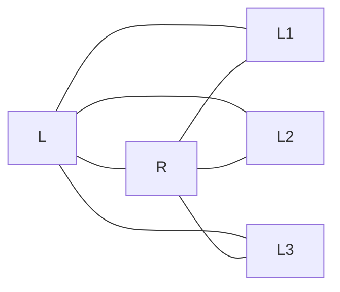

# Passes 333--337: outer symmetry, polarization, spin, and Baer separation

## Status

All five requested directions now have exact GAP verdicts.  The packet contains
five deterministic certificates and 124 passing checks:

| Pass | verifier | checks | exact verdict |
|---|---|---:|---|
| 333 | `analysis/w33_pass333_outer_s3_lift.g` | 29/29 | **BUILT:** an integral outer involution extends the Eisenstein leaf cycle to $S_3$ and the inner $U_4(2)$ image to $U_4(2).2\cong W(E_6)$. |
| 334 | `analysis/w33_pass334_selector_leaf_bundle_obstruction.g` | 20/20 | **OBSTRUCTED, WITH AN INDUCED SALVAGE:** the selector 120-set is a curved transitive coset bundle, not the flat product of 40 lines with the three Pass-332 leaves. |
| 335 | `analysis/w33_pass335_complete_stable_lattice_complex.g` | 33/33 | **CLASSIFIED:** the complete stable 2-adic fixed complex has five homothety classes; its polar lift exists, but its invariant quadratic lattice lift does not. |
| 336 | `analysis/w33_pass336_integral_halfspin_lattices.g` | 22/22 | **BUILT, BUT NOT ATTACHED:** both rank-32 integral half-spin lattices exist and are perfect duals at 2; no certified leafwise Clifford attachment follows. |
| 337 | `analysis/w33_pass337_epsilon_e8_baer_separation.g` | 20/20 | **SEPARATED:** $1+\varepsilon$ gives the split endpoint deck extension, not the nonsplit signed-$E_8$ Schur-cover class. |

This is a theorem-and-obstruction packet, not a physics derivation.  In
particular, it closes four algebraic construction questions left by Pass 332,
but it does not choose a chirality or identify a spinor with a physical
generation.

## 1. Dependency and ownership ledger

The new results sit on top of earlier objects rather than replacing their
owners:

```text
Pass 170: composition factors only
                  |
                  v
Pass 331: H10 dual numbers -----> Pass 337: epsilon -> split class
                  |                              |
                  v                              v
Pass 332: three integral H10 leaves       Pass 221: split/nonsplit
        |          |          |             signed-E8 extensions
        |          |          |
        v          v          v
 Pass 333      Pass 335    Pass 336
 outer S3      complete    integral S+ and S-
        |      2-adic complex
        |
        +---- global outer symmetry (not selector monodromy)

BT361: 40 lines x 3 selector sheets
                  |
                  v
BT1367: exact curved S3 holonomy counts
                  |
                  v
Pass 334: selector G/H -> G/K versus flat Pass-332 product
```

The ownership details matter:

- Pass 170 (`analysis/w33_pass170_modular_shadow_brauer.py`) owns the
  composition-factor match and explicitly left the extension class open.
- BT866 owns the Eisenstein-conjugate $5_a,5_b$ fusion observation.  The
  ATLAS $5_a$ representation and the exterior-algebra model of the $D_5$
  half-spins are standard inputs, not repo novelty.
- Pass 211 owns the finite $\operatorname{PGSp}(4,3)$ outer controller; Pass 333 builds
  its missing integral action on the Pass-332 lattice family.
- Pass 332 (`PASS331_332_WEIL_INTEGRAL_CHIRALITY_BRIDGE.md`) owns the three
  index-two stable leaves and their simultaneous intertwiners to the incidence
  $H_{10}$.
- Kirschmer's classification of finite symplectic matrix groups already gives
  a close external precursor to the stable-lattice count: for the relevant
  $U_4(2)$ symplectic characters it reports two global lattice-isomorphism
  classes after adjoining the Eisenstein normalizer, and five for a related
  subgroup.  Those are global $\mathbb ZG$-module isomorphism classes, not the
  local $2$-adic homothety complex computed here, but they mean that the bare
  numeral ``five'' is not claimed as new.  Pass 335 adds the explicit
  five-vertex incidence complex, its identification of the three $H_{10}$
  leaves, and the symmetric/alternating/refinement ledger.
- BT361 owns the $40\times3=120$ selector phase bundle.  BT1367
  (`analysis/BT1367_BT1369_phase_q6_scheduler_lifts.md`) owns the holonomy
  census $11070,29160,19440$ on 59670 skew quadrangles.  Pass 334 reuses and
  independently reconstructs those values in GAP; the numbers are not a new
  Pass-334 discovery.
- Pass 221 (`analysis/w33_pass221_signed_e8_gram_obstruction.g`) already owns
  the split endpoint extension versus nonsplit signed-$E_8$ pullback.  Pass
  337's contribution is the missing map from the Pass-331 dual-number unit to
  the split member of that ledger.

## 2. Pass 333 -- the predicted outer $S_3$ is an integral object

Start with the standardized ATLAS $5_a$ over
$K=\mathbb Q(\omega)$, restrict scalars to a rational 10-space, and retain
the Pass-332 stable lattice.  GAP constructs the explicit integral matrix
$T\in\mathrm{GL}_{10}(\mathbb Z)$ recorded in the JSON certificate and proves

\[
 T^2=I,\qquad \det T=-1,\qquad T\notin U_4(2),
\]

while $T$ normalizes the standardized inner image.  If $a,b$ are the two
ATLAS generators, the automorphism is frozen generator-by-generator as

\[
 T^{-1}aT=a,
\]

\[
 T^{-1}bT=(b^{-1}a)^2b^2ab^{-1}(b^{-1}a)^2b^2a.
\]

Consequently

\[
 |\langle U_4(2),T\rangle|=51840,
 \qquad [\langle U_4(2),T\rangle,\langle U_4(2),T\rangle]=U_4(2),
\]

its center is trivial, and GAP identifies it with the ATLAS group
$U_4(2).2\cong W(E_6)$.

The matrix is genuinely Eisenstein-semilinear.  In the certificate's basis it
has the compact factorization

\[
 T=R(S)C,
\]

where $C$ is coefficient conjugation, $R$ is restriction of scalars, and
$S\in\mathrm{GL}_5(\mathbb Z[\omega])$ has determinant $-1$.  It satisfies

\[
 T^{-1}\omega T=\omega^{-1},
 \qquad \langle\omega,T\rangle\cong S_3.
\]

On the three stable leaves, the exact actions are

\[
 \omega:[3,1,2],\qquad T:[1,3,2].
\]

Every induced leaf map is unimodular with determinant $-1$.  More strongly,
the six norm-one Eisenstein units $u+v\omega$ give six integral outer
involutions $(u+v\omega)T$; modulo 2 they reduce two-to-one to the three
transpositions of $\mathbb P^1(\mathbb F_2)$.

This closes Pass 332's outer-module and global $S_3$ questions.  It does not
turn the three globally permuted leaves into the selector's line-dependent
phase local system; Pass 334 distinguishes those two actions.

## 3. Pass 334 -- the selector is twisted, not a leaf product

Let

\[
 G=\operatorname{PSp}(4,3),\qquad |G|=25920.
\]

The actual selector action is transitive on 120 sheets.  If $K$ stabilizes
one W33 line and $H$ stabilizes one sheet above it, GAP obtains

\[
 |K|=648,\qquad |H|=216,
\]

and the exact coset projection

\[
 G/H\longrightarrow G/K,\qquad Hg\longmapsto Kg,
\]

with indices $120\to40$ and three points in every fibre.  The $K$-action
on a fibre is the full $S_3$, with kernel of order 108.  The selector action
has subdegrees

\[
 1,2,27,36,54
\]

and permutation-character norm 5.  Its equivariant deck centralizer is
trivial.

By contrast, the natural Pass-332 product has $G$ fix each of the three
lattice leaves.  Its 120 points split as

\[
 40+40+40,
\]

its point stabilizer has order 648, and its character norm is 27.  Adjoining
the commuting Eisenstein cycle gives $G\times C_3$, of order 77760, rather
than the selector action.

The obstruction is global, not visible from one overlap row.  The actual and
flat models have the same local profile

\[
 2^{54},4^{27},12^{36},54^2,108^1,
\]

but their connections differ.  Reconstructing the BT1367 transport in GAP
gives

\[
 \begin{array}{c|ccc}
 \text{holonomy order}&1&2&3\\ \hline
 \text{selector quadrangles}&11070&29160&19440
 \end{array}
\]

on 59670 skew quadrangles, whereas every flat-product quadrangle has identity
holonomy.

Therefore no natural $G$-equivariant bijection identifies the Pass-332
product with the selector, and no overlap-scheme isomorphism can flatten the
connection.  There is one precise constructive salvage:

\[
 G\times_K\mathbb P^1(\mathbb F_2)\cong G/H,
\]

provided one equips the three-element fibre with the selector's homomorphism
$K\to S_3$.  This imports the selector monodromy; it does not derive it from
the Pass-332 lattice commutant.

Passes 333 and 334 are thus compatible.  Pass 333 supplies a **global outer**
reflection of the integral family.  Pass 334 needs an **inner line-stabilizer**
action varying through the selector bundle.  Both are $S_3$, but they are not
the same $S_3$-action.

## 4. Pass 335 -- the complete local fixed complex

Pass 332 exhibited three neighboring lattices.  Pass 335 expands every proper
invariant-submodule direction from every discovered class through depth three
and tests 2-adic homothety exactly.  The search closes on five classes:

\[
 \{L,R,L_1,L_2,L_3\},
\]

with determinant exponents

\[
 0,2,1,1,1.
\]

The fixed building subcomplex is three triangles with a common spine:



Equivalently, its seven edges are the three triangles
$(L,R,L_i)$, and deleting the common edge leaves the $K_{2,3}$ skeleton.
The Eisenstein scalar fixes $L,R$ and cycles $L_1,L_2,L_3$.

The symmetric-form computation gives the exact negative answer requested.
The invariant symmetric space is one-dimensional.  The root and index-four
classes have respective primitive determinant/form profiles

\[
 (62208,v_2=8,\operatorname{rank}_{2}=2),\qquad
 (972,v_2=2,\operatorname{rank}_{2}=8),
\]

and are even but not unimodular at 2.  The three $H_{10}$ leaves are
unimodular at 2 but odd, each of determinant $243=3^5$.  No stable class is
both even and unimodular.  Independently, a rank-10 even plus lattice requires
odd determinant unit $7\pmod8$, whereas this rational symmetric form has
unit $3\pmod8$, the minus residue.  Thus there is no
$U_4(2)$-invariant quadratic-isometric lattice lift inside this rational
representation.

The polar half is positive and more informative than a bare obstruction.  The
unique invariant alternating form obeys the exact Hermitian relation

\[
 A=-\frac{(2\omega+1)S}{3}.
\]

On every $H_{10}$ leaf its primitive determinant is 1 and its reduction has
rank 10, so the symplectic polar lift is integral and exact.  Each reduction
has exactly two invariant plus-type quadratic refinements, each with 528
zeros.  Their difference is the invariant linear functional polar-dual to the
unique isotropic socle, and the nontrivial $H_{10}$ module automorphism swaps
the pair.  The obstruction is therefore not the absence of quadratic
refinements; it is the absence of an invariant even integral symmetric form
realizing either refinement.  No refinement is canonically selected.

## 5. Pass 336 -- integral half-spins exist on both chiral sides

For the even and odd exterior actions of $5_a$, GAP constructs invariant
rank-32 integral lattices $S^+_{\mathbb Z}$ and $S^-_{\mathbb Z}$.  Their
generators are integral and unimodular, and both images have order 25920.

After rational restriction of scalars the two modules are isomorphic, but
their reductions modulo 2 are not.  Both have composition profile

\[
 1^4+6^2+8^2,
\]

and the full mod-2 Hom space has dimension 12 and rank spectrum

\[
 \{0,1,2,8,9,10,16,17,18\},
\]

which contains no invertible rank-32 map.  The reductions are instead exact
duals under the transported trace-wedge pairing.

On the integral lattices that pairing has Smith diagonal

\[
 1^{16},3^{16},
\]

hence determinant

\[
 3^{16}=43046721
\]

and rank 32 modulo 2.  Its cokernel is $(\mathbb Z/3)^{16}$, so the pairing is
perfect over $\mathbb Z_2$.  This is the exact integral chiral pair that Pass
332 had not yet constructed.

It still does not attach functorially to an $H_{10}$ leaf.  Pass 336
recomputes the three odd determinant-$3^5$ leaf forms, and Pass 335 proves
that this is the complete local obstruction: there is no missing stable even
unimodular leaf in the same rational representation.  The integer
$43046721$ also occurred earlier in the repo as the unrelated cardinality of
$\mathrm{Cl}(4,\mathbb F_3)$; only the Smith-pairing statement above belongs
to Pass 336.

## 6. Pass 337 -- a nonsplit module extension is not a nonsplit group cover

Pass 331 gives

\[
 H_{10}:1|8|1,
 \qquad
 \operatorname{End}_{\operatorname{PGSp}(4,3)}(H_{10})
   \cong\mathbb F_2[\varepsilon]/(\varepsilon^2),
\]

where $\varepsilon$ has rank one, image equal to the unique socle, and kernel
equal to the unique 9-space radical.  The two adjacent short exact **module**
extensions are nonsplit.

The unit $1+\varepsilon$, however, is a central involution.  Adjoining it to
the full $\operatorname{PGSp}(4,3)$ image gives the internal direct product

\[
 C_2\times\operatorname{PGSp}(4,3),
\]

of order 103680, derived-subgroup order 25920, and abelian invariants
$[2,2]$.  Its quotient by the new $C_2$ recovers $\operatorname{PGSp}(4,3)$.  This is
exactly the split endpoint deck member of Pass 221's ledger.

The signed-$E_8$ pullback is different.  The ATLAS anchor
`2U42d2G1-p240B0` also has order 103680 and central quotient
$\operatorname{PGSp}(4,3)$, but its derived subgroup is the perfect
$\operatorname{Sp}(4,3)\cong 2.U_4(2)$ of order 51840 and its abelian invariants are
$[2]$.  It is the nonsplit member of the Pass-221 ledger.  The two extensions
are not isomorphic.

Therefore $\varepsilon$ is the canonical top-to-socle map and
$1+\varepsilon$ realizes the zero/split Baer class.  It is **not** the
signed-$E_8$ Bockstein or Schur-multiplier class.  There is no contradiction:
nonsplitting in the module/Yoneda category does not force nonsplitting of the
central group extension generated by a module automorphism.

## 7. Result-first audit

The inverted result index, the current paper, the Theory page, and recent
analysis notes were searched by exact formulas and integers before framing
these results.

| Item | prior corpus status | Pass-333--337 contribution |
|---|---|---|
| $62208$, $243=3^5$, three $H_{10}$ leaves | already Pass 332; Kirschmer externally anticipates the small stable-lattice count in closely related symplectic normalizers | explicit five-vertex local incidence complex and the exact polar/quadratic/refinement split |
| $59670=11070+29160+19440$ holonomy census | already BT1367 | GAP reconstruction used as the invariant separating the selector from the flat leaf product |
| split endpoint versus nonsplit signed-$E_8$ order-103680 covers | already Pass 221 | identifies $1+\varepsilon$ with the split cover and rules out equality with the signed class |
| $3^{16}=43046721$ | integer already appears as an unrelated finite Clifford-algebra size | new context is the Smith determinant of the integral half-spin wedge pairing |
| $U_4(2).2\cong W(E_6)$, ATLAS $5_a$, exterior half-spins | standard/borrowed | explicit integral outer matrix, leaf maps, invariant lattices, and exact pairings |

The repo-new claims are object-level: an explicit integral outer reflection,
the exact coset-bundle obstruction, the local stable complex with its
$H_{10}$ incidence and polar/refinement lift, the two integral half-spin
lattices with their Smith pairing, and the map placing $1+\varepsilon$ in the
already-known extension ledger.  The five-class count has a close external
precursor, and this is not a global priority claim.

## 8. Honest scope

What is now closed:

1. the missing integral outer action on the three Pass-332 leaves;
2. the resulting global $S_3$ reflection group;
3. the comparison with the actual 120-sheet selector as a precise
   nonisomorphism of $G$-sets and connections;
4. the complete local stable-lattice classification in the selected rational
   representation;
5. the integral existence and 2-adic duality of both half-spin lattices;
6. the categorical identity of the dual-number deck class.

What is not closed:

- the selector monodromy is not derived from the Pass-332 lattice family;
- the symmetric quadratic lattice lift is obstructed in this rational
  representation, although the symplectic polar lift exists;
- neither of the two invariant quadratic refinements is canonically selected;
- the integral half-spins are not functorially obtained from an $H_{10}$
  leaf by a certified integral Clifford construction;
- no chirality is selected and no Standard Model or physical-generation
  identification follows;
- no global novelty claim is made for the standard ATLAS, Weyl-group,
  Clifford, or spin ingredients.

## 9. Reproduction

All mathematical experiments are GAP-owned:

```bash
gap -q analysis/w33_pass333_outer_s3_lift.g
gap -q analysis/w33_pass334_selector_leaf_bundle_obstruction.g
gap -q analysis/w33_pass335_complete_stable_lattice_complex.g
gap -q analysis/w33_pass336_integral_halfspin_lattices.g
gap -q analysis/w33_pass337_epsilon_e8_baer_separation.g
```

Generated certificates:

- `data/w33_pass333_outer_s3_lift.json`
- `data/w33_pass334_selector_leaf_bundle_obstruction.json`
- `data/w33_pass335_complete_stable_lattice_complex.json`
- `data/w33_pass336_integral_halfspin_lattices.json`
- `data/w33_pass337_epsilon_e8_baer_separation.json`

The verifiers require GAP with AtlasRep; Pass 335 also loads CTblLib and uses
the MeatAxe module routines.  JSON parsing is a serialization check only, not
a replacement implementation of the mathematics.

## Primary anchors

- [ATLAS/CTblLib $U_4(2)$ data](https://www.math.rwth-aachen.de/homes/sam/ctbllib/ctbltoc/data/U4%282%29.html)
- [ATLAS/CTblLib $U_4(2).2$ data](https://www.math.rwth-aachen.de/~Thomas.Breuer/ctbllib/ctbltoc/data/U4%282%29.2.html)
- [Nebe, finite unitary group representations](https://www.math.rwth-aachen.de/~Gabriele.Nebe/papers/Unitary.pdf)
- [Kirschmer, *Finite symplectic matrix groups*](https://www.math.rwth-aachen.de/~Markus.Kirschmer/symplectic/thesis.pdf), especially the $U_4(2)$ lattice counts on pp. 112--113
