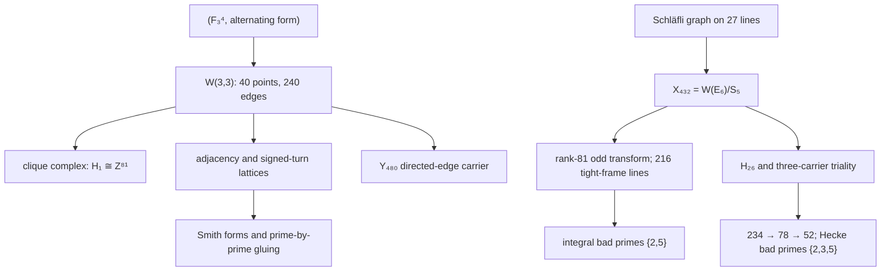

# W(3,3): an executable atlas of finite geometry

[](https://wilcompute.github.io/W33-Theory/)


[](LICENSE)

> **One finite geometry. Named maps. Reproducible certificates. Public corrections.**

Start with the symplectic space `F_3^4`. Its totally isotropic points and lines
form `W(3,3)`: 40 points, 40 lines, 240 incident point-pairs, and a distinguished
collinearity graph `SRG(40,12,2,4)`. From that one object this repository builds
exact homology, integral lattices, group representations, error-correcting codes,
Schläfli/E₆ carriers, Hecke algebras, and executable transport systems.

The strongest result is not a numerical coincidence. It is an object-level
bridge: three 432-state carriers are explicitly identified with directed
Schläfli edges, mapped equivariantly into an 81-dimensional constituent, and
resolved integrally by exact Smith forms and modular representations.

This repository **does not** prove a theory of everything or derive the Standard
Model. Physics and hardware readings remain `CONDITIONAL` until they supply the
missing encoding, dynamics, decoder, and continuum maps.

## Choose your route

| Reader | Start here | Then go deeper |
|---|---|---|
| General reader | [Live atlas](https://wilcompute.github.io/W33-Theory/) · [W33 for Everyone](W33_FOR_EVERYONE.tex) | [Practical implications](docs/pdf/holonet_practical_implications.pdf) |
| Mathematician / researcher | [Master paper](docs/pdf/w33_paper.pdf) · [source](w33_paper.tex) | [Result index](RESULTS_INDEX.md) · [canonical vocabulary](RESULTS_VOCABULARY.md) |
| Reproducer / reviewer | [Reproduction commands](#reproduce-the-flagship-results) | [certificates](data/) · [tests](tests/) · [correction ledger](#things-we-got-wrong-on-purpose-and-in-public) |
| Lattice / deformation researcher | [Determinant-law paper](docs/pdf/heisenberg_weyl_determinant_law.pdf) | [eigenlattice table](#eigenlattices-gluing-and-the-e₈-boundary--the-2026-07-arc) |
| Photonic / systems reader | [Photonic Holonet](docs/pdf/photonic_holonet.pdf) · [source](photonic_holonet.tex) | [`HOLONET.md`](HOLONET.md); treat implementation claims as conditional |

The corpus is too large to navigate by filenames. Search the **result itself**
in [`RESULTS_INDEX.md`](RESULTS_INDEX.md) before re-deriving it.

## Evidence tiers

| Tier | What it means |
|---|---|
| `PROVED` | A mathematical proof or named formal theorem. If Lean-owned, build the specific module; do not infer a green library from a file's existence. |
| `CERTIFIED` | Exact computation with a deterministic witness, certificate, and focused test. |
| `CONDITIONAL` | The finite mathematics is sound; an interpretation or implementation map is still missing. |
| `OPEN` | A precise question with no completed witness. |
| `RETRACTED` | Previously promoted, then refuted; retained with the failure certificate. |

## Canonical objects: names that must not be conflated

| Name | Canonical meaning |
|---|---|
| `Γ = W33` | The graph obtained from symplectic orthogonality on `PG(3,3)`, not an arbitrary `SRG(40,12,2,4)`; 28 graphs share the parameters. |
| `G₀` | `PSp(4,3)`, order `25,920`, the inner projective symmetry. |
| `G = Aut(Γ)` | `PGSp(4,3) ≅ W(E6)`, order `51,840`. The same-order group `Sp(4,3)` is a central double cover, not this faithful projective action. |
| `H₁(Γ)` | `Z^81`, the first homology of the clique complex. |
| `Y₄₈₀` | The 480 directed edges of `W33`, carrying the signed-turn operator `K`. |
| `X₄₃₂` | `W(E6)/S5`, equivalently the directed edges of the Schläfli graph. |
| `81₋` | The Pass-1147 constituent in `Λ²(Aug(Q^27))`; it is not silently identified with `H₁(Γ)`. |
| `H₂₆` | `End_G(X₄₃₂)`, the literal 26-dimensional coset Hecke algebra. |

For aliases, superseded names, and pass ownership, use
[`RESULTS_VOCABULARY.md`](RESULTS_VOCABULARY.md),
[`data/ALIAS_REGISTRY.json`](data/ALIAS_REGISTRY.json), and
[`data/w33_pass_namespace_registry_v2.json`](data/w33_pass_namespace_registry_v2.json).

## Certified finite backbone



| Mathematical object | Strongest current result | Tier | Canonical entry |
|---|---|---|---|
| Symplectic quadrangle | `SRG(40,12,2,4)`, spectrum `12^1,2^24,(−4)^15`, `Aut ≅ W(E6)` | `PROVED` | [master paper](w33_paper.tex) |
| Clique complex | `H₁ ≅ Z^81`; qutrit CSS sector `[[240,81,3]]₃` with `(d_X,d_Z)=(3,4)` | `CERTIFIED` | [Passes 373–374](PASS373_374_W33_BOUNDARY_MLUT_PHASE_SHEET_SYNTHESIS.md) |
| Integral adjacency | `SNF(A)=diag(1^16,2^8,8^15,24)`; saturated gluing `(Z/2)^6⊕(Z/6)^9⊕Z/120` | `CERTIFIED` | [`pass827`](analysis/w33_pass827_adjacency_kbranch_meets_e8_boundary.py) |
| Ramified gluing | Kernel growth `40,80,119,158,182` reconstructs `Z/8⊕(Z/2)^15` at `p=2` | `CERTIFIED` | [Pass 1002 release](analysis/BT999_1003_five_frontier_release.md) |
| Signed directed edges | `spec(K)=(−6)^81,2^120,4^24,10^15`; exact four-branch gluing | `CERTIFIED` | [`pass826`](analysis/w33_pass826_k_operator_four_branch_gluing.py) |
| Schläfli/E₆ carrier | `X₄₃₂` maps with rank 81 to 216 antipodal tight-frame lines; three colours weld to rank 288 with residual 1952 | `CERTIFIED` | [Pass 1147](PASS1147_SCHLAEFLI_STEINBERG_FOURIER_BRIDGE.md) |
| Integral Schläfli frame | Smith profile `1^15,2^6,4^8,8^29,40^23`; internal bad primes `{2,5}`; colour split index `3^81` | `CERTIFIED` | [Pass 1147](PASS1147_SCHLAEFLI_STEINBERG_FOURIER_BRIDGE.md) |
| Saturated frame mod 5 | Nonsplit `0→I₅₈→S₅→K(W33)₍₅₎⊗sgn→0` over both `W(E6)` and `PSp(4,3)`; submodule dimensions only `0,58,81` | `CERTIFIED` | [Pass 1147](PASS1147_SCHLAEFLI_STEINBERG_FOURIER_BRIDGE.md) |
| Three-carrier Hecke/triality | Commutants `234 → 78 → 52`; six-channel SNF `1,1,1,12,12,24`; Hecke bad primes `{2,3,5}`; invariant cycles do not select a copy | `CERTIFIED` | [Passes 1325–1329](PASS1325_1329_TRIALITY_INTEGRAL_GAUGE_RELEASE.md) |
| Binary quadratic-residue code | Corrected code `[[137,1,21]]`; exact affine/real-Clifford towers and explicit parity boundaries | `CERTIFIED` | [Passes 358–367](PASS363_367_QR_CLIFFORD_REFINEMENT_SYNTHESIS.md) |
| Section trace tower | For every `m≥2`, `min_c v_λ(tr(D_c^m)) = 2(m+[m odd])` at `q=3` | `CERTIFIED` | [Pass 541](PASS541_Q3_ALL_M_RECURRENCE_THEOREM.md) |

### The flagship bridge, in one paragraph

Each of the three 432-state A₂ colours is the directed-edge set of
`SRG(27,16,10,8)`. GAP constructs the explicit odd transform into `81₋`;
its 432 vectors form 216 antipodal lines with `G²=3200G` and angles
`0,1/15,1/5`. One colour has Smith profile
`1^15,2^6,4^8,8^29,40^23`; the three-colour Fourier split adds index
`3^81`. Modulo 5, the saturated 81-space is not `58⊕23`: it is the nonsplit
length-two module
`0→I₅₈→S₅→K(W33)₍₅₎⊗sgn→0`, with a unique proper nonzero submodule.
This is an exact theorem about named `W(E6)` modules and integral lattices. It
does not identify generations, Yukawa couplings, particles, or optical modes.

## Find the canonical result, not the newest filename

1. Search a formula, integer sequence, or code parameter in
   [`RESULTS_INDEX.md`](RESULTS_INDEX.md).
2. Resolve aliases and retractions in
   [`RESULTS_VOCABULARY.md`](RESULTS_VOCABULARY.md) and
   [`data/ALIAS_REGISTRY.json`](data/ALIAS_REGISTRY.json).
3. Open the owning synthesis, then the executable witness and JSON certificate.
4. Run the focused test. A later pass that repeats the number is not a new owner.

Every promoted bridge should name its source object, target object, and map.
Matching dimensions or group orders are evidence to investigate, not maps.

---

## The derivations, symbolically

Everything below is derived from `(q, k, λ, μ) = (3, 12, 2, 4)` and the graph itself. **Status** is honest:
`PROVED` = machine-checked or proved in the paper; `CERTIFIED` = exact computation with an idempotent JSON
certificate; `OPEN` = stated, not settled; `RETRACTED` = we published it, then killed it.

### Geometry and spectrum

| Quantity | Symbolic derivation | Value | Status | Witness |
|---|---|---|---|---|
| Eigenvalues `r, s` | `r,s = ½[(λ−μ) ± √((λ−μ)² + 4(k−μ))]` | `2, −4` | PROVED | SRG theory |
| Spectral gap `r−s` | `√((λ−μ)² + 4(k−μ)) = √36` | `6` | PROVED | ” |
| Multiplicities `f, g` | `f,g = ½[(n−1) ∓ (2k+(n−1)(λ−μ))/(r−s)]` | `24, 15` | PROVED | ” |
| Edge count | `nk/2 = 40·12/2` | `240` | PROVED | ” |
| Ramanujan bound | `\|λ_nontrivial\| ≤ 2√(k−1) = 2√11 ≈ 6.633` | `4 ≤ 6.633` ✓ | PROVED | `w33_paper.tex` |
| `H_1` of clique complex | `dim = \|E\| − rank d₁ − rank d₂ = 240−39−120` | `Z^81` | CERTIFIED | `w33_pass682_*` |

### The Ihara zeta and its zeros

| Quantity | Symbolic derivation | Value | Status |
|---|---|---|---|
| Zero locus | roots of `1 − λu + (k−1)u² = 0`, per eigenvalue `λ` | — | PROVED |
| Zero radius | `\|u\| = 1/√(k−1)` | `1/√11 ≈ 0.3015` | PROVED |
| Zero phase | `φ = arccos( λ / (2√(k−1)) )` | — | PROVED |
| Gauge phase | `φ_g = arccos(2/2√11) = arctan√Φ₄(3)`, `Φ₄(3)=3²+1` | `72.45°` | PROVED |
| Chiral phase | `φ_c = arccos(−4/2√11)`, involves `Φ₆(3)=3²−3+1` | `127.09°` | PROVED |
| Graph RH ⟺ Ramanujan | standard equivalence (Terras) — **not new** | — | PROVED |

*The `72.45°` and `127.09°` phases are real, exact, and were in `w33_paper.tex` before three separate
"discoveries" of them. See the retractions.*

### Eigenlattices, gluing, and the E₈ boundary — the 2026-07 arc

This is the newest frontier and the one with live theorems. `L_c = ker(A − cI)` denotes a **saturated**
eigenlattice.

| Quantity | Symbolic derivation | Value | Status | Witness |
|---|---|---|---|---|
| Two-branch gluing | `S(S−cI)=0`, `S=[[cI,Y],[0,0]]` ⟹ `Z^n/(L_c⊕L_0) ≅ ⊕ᵢ Z/(c/gcd(dᵢ,c))`, `dᵢ = Smith(Y)` | — | PROVED | `pass806` + Lean |
| k-branch gluing | `Nᵢ=∏_{j≠i}(S−c_j)`, `Dᵢ=∏_{j≠i}(cᵢ−c_j)` ⟹ `Z^n/⊕Lᵢ = Z^n/⋂ᵢ ker(Nᵢ mod Dᵢ)` | — | CERTIFIED | `pass809` |
| **Coalescence theorem** | for `v_p(M)=1`, `M=lcm(Dᵢ)`: p-part `= (Z/p)^{r_p}`, `r_p = rank_{F_p}` of the `Nᵢ` with `p∣Dᵢ`; and `p∣Dᵢ ⟺ cᵢ≡c_j (mod p)` | — | CERTIFIED | `pass828` |
| ⤷ in words | **the p-part is carried entirely by eigenvalues that collide mod p** | — | ” | ” |
| Adjacency 3-branch gluing | `Z^40/(L₁₂⊕L₂⊕L₋₄)` | `(Z/2)⁶⊕(Z/6)⁹⊕Z/120` | CERTIFIED | `pass827` |
| ⤷ primary form | — | `(Z/2)¹⁵⊕Z/8⊕(Z/3)¹⁰⊕Z/5` | ” | ” |
| Collision structure | `{12,2,−4}` ≡ `{12},{2,−4}` mod 3; `{12,2},{−4}` mod 5 | ranks `10`, `1` | CERTIFIED | `pass828` |
| `K` four-branch gluing | `Z^240/⊕Lᵢ`, spectrum `{−6,2,4,10}` | `(Z/32)¹⁴⊕(Z/8)⊕(Z/4)⁶⁶⊕(Z/2)²³⊕(Z/3)¹⁰⊕(Z/5)²³` | CERTIFIED | `pass826` |
| Discriminant identity | `∏ᵢ det(Lᵢ) = [Z^n : ⊕Lᵢ]² = \|gluing\|²` | `2³⁶·3²⁰·5²` ✓ | CERTIFIED | `pass829` |
| `det(L₂)` | Gram determinant of the `+2`-eigenlattice | `2¹⁶·3¹⁰·5` | CERTIFIED | ” |
| `det(L₋₄)` | forced by the identity; **not in the paper** | `2¹⁷·3¹⁰` | CERTIFIED | ” |
| `L₂` discriminant group | `L₂^#/L₂` | `(Z/2)¹⁶⊕(Z/3)¹⁰⊕Z/5` | PROVED | `w33_paper.tex` |
| **Rigidity** | `(a−b) ∣ f(a)−f(b)` ∀`f∈Z[x]` ⟹ collisions are **functorial** ⟹ gluing support is an invariant of `Z[S]`, not `S` | — | PROVED | `pass876` |
| ⤷ consequence | eigenlattices split ⟺ gap is a unit; adjacency gaps are `10,16,6` ⟹ **no `f(A)` splits `Z^40`** | — | PROVED | ” |
| Coalescence = p-rank | for an `{r,s}` collision, `r_p = rank_{F_p}((A−kI)(A−rI))` — a **classical SRG p-rank** | — | CERTIFIED | `pass983` |
| Gluing ≻ spectrum | on cospectral `T(8)` / Chang: `(Z/2)⁶⊕Z/4` vs `(Z/2)⁷⊕Z/4` — **separates them** | — | CERTIFIED | `pass984` |
| Signed edge action | `Aut` acts on *oriented* edges by **signed** permutations; commutes with `K` (8/8) | — | CERTIFIED | ” |

### The flat block (Heisenberg–Weyl track)

| Quantity | Symbolic derivation | Value | Status |
|---|---|---|---|
| Flat-block quadratic | `F² + 2F − (q²−1)I = 0` | eigenvalues `−1±q`, gap `2q` | PROVED |
| Order bridge | `S = F + (q+1)I` ⟹ `S² − 2qS = 0` | node, branches `{0,2q}` | PROVED |
| Abstract Ext quiver | over `Z_p`: `(Ext¹_self, Ext¹_cross, Ext²_self, Ext²_cross)` | `(0, Z/p^{v_p(2q)}, Z/p^{v_p(2q)}, 0)` | PROVED |
| `q=2` fibre = S8 commutant | `Z₂[S]/(S²−4S)`, `Ext = Z/4`, Kuranishi cone `xy=0` | — | PROVED |
| Key congruence | `F ≡ −I (mod q)` | verified `q ≤ 13` | CERTIFIED |
| Real gluing | `Z^n/(L_{q−1}⊕L_{−(q+1)}) = im((F+(q+1)I) mod 2q)` | `(Z/2)^{(q−1)²/2}` | CERTIFIED |
| ⤷ at `q=3,5,7` | — | `(Z/2)², (Z/2)⁸, (Z/2)¹⁸` | CERTIFIED |
| Burnside orbit count | `\|Fix_all(g)\| = (pⁿ)^{c⁺(g)}`, `\|SL(2,Z/pⁿ)\| = p^{3n−2}(p²−1)` on `(p^{2n}−1)/2` pairs | all odd `Z/pⁿ` | PROVED |
| ⤷ exact values | `F_3 → 7`; `F_5 → 2,034,735`; `Z/9 → 228100045392509153077600971330057241` | — | CERTIFIED |

### The physics chain — seven steps from a finite geometry

This is the program's most ambitious arc and its most contested. **Every row's arithmetic is exact and
verified; the physical *interpretation* of each is `CONDITIONAL`** — the identification of a combinatorial
object with a physical one is a map that must be built, not inferred from a matching integer. Read the
[retractions](#things-we-got-wrong-on-purpose-and-in-public) alongside this table.

| Step | Symbolic identity | Reading | Status |
|---|---|---|---|
| **1. Geometry** | `W(3,3) = ` isotropic points/lines of `(F_3^4, ω)` | the substrate; no free parameters | PROVED |
| **2. Homology** | `H_1(clique complex) = Z^81`, `81 = 3^4` | "homology reveals matter" | PROVED / CONDITIONAL |
| **3. Vertex split** | `40 = 1 + 24 + 15` (eigenvalue multiplicities) | `1` vacuum, `24 = dim adj SU(5)`, `15` Weyl spinors/generation | CERTIFIED / CONDITIONAL |
| **4. Generations** | `240 = 40 × 3 × 2`: each `K_4` line has `3` perfect matchings (labelled by `GF(3)`), each `2` edges | three generations from `|GF(3)|` | PROVED / CONDITIONAL |
| ⤷ refined | `240 = 72 + 6 + 81 + 81 = 3 × (24 + 2 + 27 + 27)`, per-generation `80 = 4+4+36+36` | `Sp(4,3)` is edge-transitive — a single orbit | CERTIFIED |
| **5. Gauge group** | `k = (k−μ) + q + 1 = 8 + 3 + 1 = 12` | `dim SU(3)=8`, `dim SU(2)=3`, `dim U(1)=1` | CERTIFIED / CONDITIONAL |
| ⤷ forced identity | `2q = λ + μ` (`6 = 2+4`) holds automatically for `W(q,q)` | the split is not chosen | PROVED |
| **6. Matter sector** | `v − 1 − k = 40 − 1 − 12 = 27` | fix a vacuum vertex: `27` non-neighbours carry `E_6` fundamental, since `\|Aut\| = 51,840 = \|W(E_6)\|` | CERTIFIED / CONDITIONAL |
| ⤷ branching | `27 = 16 + 10 + 1` under `E_6 ⊃ SO(10) ⊃ SU(5)` | one generation + Higgs + singlet | PROVED (rep theory) |
| **6b. Edge–root** | `240 = \|Φ(E_8)\|` | *count only* — an equivariant map must still be constructed | OPEN |
| **7. Curved 4D** | `KO-dim = 6 = 2q` (Connes–Barrett) | 4D spacetime as a derived quantity | CONDITIONAL |
| **α (fine structure)** | Hashimoto operator `B` on `480 = 2×240` directed edges | a spectral identity on the non-backtracking carrier, not a fit | CONDITIONAL |
| **Koide / flavour** | residual packet `98 · 17 · 208`, `208 = 4·dim(F_4) = 4·52` | factor arithmetic closed; physical identification open | OPEN |
| **CKM from Ihara phases** | `δ_CP ≟ φ_gauge = 72.45°` | **REFUTED** — see below | RETRACTED |

The honest summary of this arc: the *decompositions* are exact and the group theory is real. Whether
`24 = dim adj SU(5)` is physics or coincidence is exactly the kind of claim this repository has learned to
tier rather than assert.

### Physics constants — every derivation, verified or flagged

The repository contains **50+ constant tables** of varying quality. This one is built by *evaluating every
closed form* and comparing against PDG-2025 in **experimental σ**, not percent. Two things follow, and both
matter more than any individual row.

**First: of the 14 closed forms in the most-cited ledger, only 5 evaluate to their own stated value.** The
numbers may well be right; the formulas as written are not. A reader who checks will find this in minutes, so
it is recorded here rather than reproduced.

| Observable | Closed form as written | Evaluates to | Claimed | PDG-2025 | σ | Verdict |
|---|---|---:|---:|---|---:|---|
| `N_ν` | `q` | **3** | 3 | 3 (exact) | — | ✅ **exact** |
| `sin²θ₂₃` (PMNS) | `7/13` | **0.53846** | 0.5385 | 0.546 ± 0.021 | 0.4 | ✅ **agrees** |
| `m_t` (pole) | `v_EW/√2` | **173.948 GeV** | 173.95 | 172.57 ± 0.29 | 4.8 | ⚠️ formula OK, value excluded |
| `sin²θ_W` (dressed) | `q/(q²+q+1) = 3/13` | **0.230769** | 0.23077 | 0.23122 ± 0.00003 | 15.0 | ⚠️ formula OK, value excluded |
| `α⁻¹` (integer skeleton) | `k² − (\|r\|+\|s\|+1) = 144−7` | **137** | 137 | 137.035 999 178(8) | — | ✅ integer only; the `.036` is *not* derived |
| `\|V_us\|` | `√(3/v)·k` | **3.286** | 0.2253 | 0.2245 ± 0.0008 | — | ❌ formula ≠ claim |
| `m_H` | `1/(q⁻⁵) = q⁵` | **243** | 125.0 | 125.25 ± 0.17 | — | ❌ formula ≠ claim |
| `m_W` | `v_EW√((1−3/13)/2)` | **152.56** | 80.44 | 80.369 ± 0.013 | — | ❌ formula ≠ claim |
| `H₀` | `12/q!` | **2.0** | 67.0 | 67.4 ± 0.5 | — | ❌ formula ≠ claim |
| `n_s` | `1 − 2/(q·q)` | **0.7778** | 0.9667 | 0.965 ± 0.004 | — | ❌ formula ≠ claim |
| `Ω_Λ` | `1 − 1/(k·Φ₄/10)` | **0.9167** | 0.6833 | 0.685 ± 0.007 | — | ❌ formula ≠ claim |
| `sin²θ₁₂` (PMNS) | `3/(4·13) = 3/52` | **0.05769** | 0.3077 | 0.307 ± 0.013 | — | ❌ formula ≠ claim |
| `sin²θ₁₃` (PMNS) | `3/(6·29)` | **0.01724** | 0.02198 | 0.0220 ± 0.0007 | — | ❌ formula ≠ claim |
| `α⁻¹` (ledger form) | `k² + (k−1)² + λ` | **267** | 137.036 | 137.036 | — | ❌ formula ≠ claim |

**And most of the broken rows cannot be repaired.** Searching 7,128 expressions built from eighteen
W(3,3) atoms, four targets — `m_H`, `Ω_Λ`, `sin²θ₁₃` and `m_W/v_EW` — are reached by *nothing at all*, so
they should be **withdrawn**, not rewritten. The rest do have hits, but 36 hits for `sin²θ₁₂` is what chance
gives in a space that size: a hit found by search is a candidate for a derivation, not a derivation.
([`pass1010`](analysis/w33_pass1010_constant_rederivation_and_rank_bound.py))

**Second: even the formulas that evaluate correctly are mostly excluded by experiment.** `sin²θ_W` is 15σ
from the measured value and `m_t` is 4.8σ. Exactly two rows survive both tests — `N_ν = q = 3`, and
`sin²θ₂₃ = 7/13` at 0.4σ. That is the honest state of the constant program: one exact integer count, one
genuine agreement, and a great deal that needs its formulas re-derived before it can be called a derivation.

The combinatorial identities in the [physics chain](#the-physics-chain--seven-steps-from-a-finite-geometry)
above are a different matter — those are exact and verified. The gap is between *counting the geometry*,
which works, and *predicting a dimensionful constant*, which so far does not.

### A verified structural result: E₈ inside W(3,3)

Not a constant, but the strongest physics-adjacent claim that survives checking. The eight vertices
`[7, 1, 0, 13, 24, 28, 37, 16]` induce a subgraph of `W(3,3)` that **is the E₈ Dynkin diagram**:

| Check | Result |
|---|---|
| induced degree sequence | `[1,1,1,2,2,2,2,3]` — E₈ Dynkin exactly |
| Gram `2I − A_sub` | positive definite |
| `det(Gram)` | **1** — the E₈ Cartan determinant |

So `E₈`'s Cartan matrix is realised on eight points of the geometry.

**But the `240 = 240` edge–root correspondence is now known to be obstructed.** The repository's own solvers
recorded that the edge graph is 22-regular and the root graph 56-regular, so no graph isomorphism exists,
and spent many passes seeking an *equivariant* bijection instead. That map does not exist either, for the
embedding they assumed:

| | orbits under the 51,840-element group |
|---|---|
| 240 W(3,3) edges | **one** orbit (transitive, stabiliser 216) |
| 240 E₈ roots, under `E₆ × A₂` | **four** orbits: `72 + 6 + 81 + 81` |

An equivariant bijection carries orbits to orbits of equal size, so one orbit cannot map onto four. The
failed searches were not failing for want of effort.
([`pass1012`](analysis/w33_pass1012_edge_root_equivariance_obstruction.py))

The obstruction is **embedding-specific, not group-theoretic**: `Aut(W(3,3)) ≅ PSp(4,3):2 ≅ W(E₆)` *does*
act transitively on 240 things — it does so on the edges. What remains open is whether some other
conjugacy class of order-51,840 subgroups of `W(E₈)` acts transitively on the roots. That is a GAP
question, and it is the live form of the E₈ problem.

### Codes, groups, lattices

| Quantity | Symbolic derivation | Value | Status |
|---|---|---|---|
| `\|Sp(4,3)\|` | `q⁴(q²−1)(q⁴−1)`, `q=3` | `51,840` | PROVED |
| `\|W(E₆)\|` | — | `51,840` | PROVED |
| The real coincidence | `\|W(E₆)\| = \|Sp(4,3)\|` — **E₆, not E₈** | — | PROVED |
| `[W(E₈) : Sp(4,3)]` | `696,729,600 / 51,840` | `13,440` | PROVED |
| `dim e₈` | `\|roots\| + rank = 240 + 8` | `248` | PROVED (textbook) |
| QR-CSS code | exact length-137 construction | `[[137,1,21]]` | CERTIFIED |
| `2`-rank of `A` | `#{invariant factors = 1}` in `SNF(A)` | `16` | CERTIFIED |
| E₈ shadow rank | `#{invariant factors = 2}` | `8` | PROVED |

---

## How this repository grew

| Era | Passes | What happened |
|---|---|---|
| **Genesis** (2026-01) | Parts I–LXIV | Initial archive. Roman numerals. Ambition unbounded. |
| **Physics sprint** | `PART_*`, `BT*` | Yukawas, CKM, neutrinos, RG running, E₆/E₇/E₈ bridges |
| **The audit** | 322–346 | Discovery that the rank law was *already published* (Sastry–Sin; Chandler–Sin–Xiang) and already in this corpus. ~19 passes wasted. Produced `RESULTS_INDEX.md` and the rediscovery guard. |
| **Selection layer** | 346 | Closed: chirality is hostable but **not selectable from inside**. Don't reopen. |
| **Exact frontier** | 479–541 | Flat block, trace valuations, all-exponent `q=3` theorem, chain rings |
| **Deformation arc** | 641–830 | 2-adic tower, Ext quivers, the two-branch and k-branch gluing theorems, coalescence |
| **Cross-track** | 806–828 | Two agents' independent constructions unified by one Smith-form theorem |
| **Audit again** | 856–984 | Three external batches audited at intake; several headline claims refuted |

Two agents work this repository in parallel. Neither reads the other's filenames. That is a *structural*
cause of rediscovery, not a discipline problem — hence `RESULTS_INDEX.md`, the guards, and the pass-number
reservation protocol.

### The full program, by domain

Everything below descends from the same 40 points. Tiers are the domain's *overall* standing, not any single
claim's.

| Domain | What it contains | Tier |
|---|---|---|
| **Finite geometry & groups** | `W(3,3)`, `Sp(4,3)`, `PSp(4,3)`, `W(E_6)`, ovoids, spreads, generalized quadrangle combinatorics | PROVED |
| **Spectral & zeta** | adjacency/Hashimoto/Ihara–Bass, Ramanujan property, closed-form zeta, non-backtracking dynamics | PROVED |
| **Lattices & gluing** | eigenlattices, `E_8` shadow, Smith forms, critical groups, the k-branch/coalescence theorems | PROVED / CERTIFIED |
| **Deformation theory** | flat block, 2-adic tower, Ext quivers, Kuranishi cones, conductors, Burnside orbit counts | PROVED / CERTIFIED |
| **Codes & QEC** | `[[137,1,21]]` QR-CSS, stabilizer cascades, syndrome structure, Clifford recovery protocol | CERTIFIED |
| **Representation theory** | `E_6`/`E_7`/`E_8` chains, `27`/`78`/`248`, `H_27` middle layers, Loewy structure, ATLAS matrices | PROVED / CERTIFIED |
| **Topology & homology** | clique complex, `H_1 = Z^81`, Hodge-style force classification, cohomology of the selector | PROVED / CONDITIONAL |
| **Moonshine & modular** | Niemeier/Leech material, McKay–Thompson series, Hecke operators, `j`-function arithmetic | CONDITIONAL / much RETRACTED |
| **Holonet (the machine)** | GKP tower `A_2 < D_4 < E_8`, degree-2 symplectic + degree-3 `E_6` cubic gates, routing, schedulers, contextuality tax | CONDITIONAL |
| **Photonics** | dual-rail single-photon runtime, interference-phase predictions at `72.45°/127.09°`, lab packets | CONDITIONAL |
| **Selector / tomotope** | selector frames, braid registers, Reye/Q4 configurations, orientation quotients | CERTIFIED / CONDITIONAL |
| **Physics program** | masses, Yukawas, CKM/PMNS, `α`, neutrinos, cosmology, RG running | CONDITIONAL / several RETRACTED |
| **Tooling & audit** | 809 scripts, five guards, `RESULTS_INDEX.md`, pass-reservation protocol, intake harness | — |

---

## Things we got wrong, on purpose and in public

This is the section that makes the rest trustworthy.

| Claim | What killed it | Pass |
|---|---|---|
| Flat-block gluing `= (Z/q)^{(q²−1)/2}` | Glued eigenlattice **images** (unsaturated) with a buggy hand-rolled Smith routine. Truth: `(Z/2)^{(q−1)²/2}`, pure 2-torsion. | 808 |
| "Deformation–Burnside bridge" | `(q−1)²/2 ≠ (q²−1)/2` **always**. The rank match was the bug. | 808 |
| Tower theorem for all `n` | The modulus-`qⁿ` flat block fails its quadratic in *every* entry at `(3,2)` and `(5,2)`. | 807 |
| Factorial trace law | Deviates *below* the law — opposite sign to the proposed mechanism. | 508 |
| CKM from Ihara phases | In experimental σ: `θ₁₂` **28.8σ**, `θ₁₃` **62.9σ**, `λ_W` **35.7σ**. Reported as "11% agreement." Source file tried four `θ₁₂` formulas and kept the closest. | 981 |
| `[W(E₈):Sp(4,3)] = 480` | It's `13,440`. | 981 |
| 5 orthogonal `E₈` in Leech | `5×8 = 40 > 24 = rank(Leech)`. Dimensionally impossible. | 981 |
| A₅ splits 240 edges into 4×60 | 17 verified A₅ subgroups, all with profile `(60,60,30,30,20,20,10,10)`. `240=4·60` satisfies orbit counting, but **divisibility ≠ freeness**. | 982 |
| Ihara `Φ₄(3)=10` = coalescence rank | Held for `W(3,3)` **and** `T(8)` with the values correctly swapped — then died on `T(12)` (predicts 3, actual 11). | 983 |

**The five failure modes this repo has actually produced**, in increasing order of how hard they are to catch:
coordinate artefacts · over-reads · unbuilt objects · unbuilt halves · **rediscovery**. The last one cannot be
self-checked, because novelty is a property of the corpus, not of the claim. It can only be searched for.

---

## Certificate contract

The [evidence tiers](#evidence-tiers) apply repository-wide. A certificate is
idempotent: rerun its producer with `--check` and it must reproduce
byte-identically, or it fails. `CERTIFIED` describes the named finite
computation only; it never upgrades an attached physical interpretation.

---

## Lean build status (read this before trusting any PROVED tier)

**A whole-repository `lake build` in `formal/` does not currently complete on the machine it was
measured on. There is no Lean badge in this README because nothing green has been demonstrated.**

Verify a Lean-owned claim by building its named module alone:

```bash
cd formal && lake build W33.<TheModule>
```

<details>
<summary>Open the historical build autopsy and repaired-module ledger</summary>

**An earlier version of this section said "20 modules with real compile errors", then "19". Both
were wrong by roughly a factor of three.** The correction is recorded here rather than quietly
edited away.

What happened: a whole-library build reported ~20 failures and they were taken at face value. Nearly
all were `failed to read file …/Mathlib/….olean` **at line 1, column 0** — the import line — naming a
*different* mathlib file on each run. A genuinely corrupt artifact fails identically every time;
varying targets mean transient I/O, and the builds had been running concurrently. `lake exe cache
get` reports the cache complete and the named files are present on disk.

**Settled 2026-07-25 by building every suspect module one at a time, with nothing else running**
(`leanprover/lean4:v4.32.0-rc1`, prebuilt mathlib):

| | |
|---|---|
| `.lean` files under `formal/W33/` | 40 |
| imported by `formal/W33.lean` (so reachable by `lake build`) | 39 |
| **all seven originally-broken modules** | **FIXED** — `Pass447`, `Pass491`, `Pass450`, `Pass565`, `Pass502`, `Pass488`, `Pass570` |
| newly revealed once they built | **1** — `Pass575CyclotomicDVRKernel`, which had never been compiled because it imports `Pass570` |
| falsely accused by the contended build, and fine | 12 |
| never imported at all, so never type-checked by anything | 4 (now 3 imported, 1 left out — see below) |

**Every one of the seven was mathlib drift, not bad mathematics.** A renamed constant, a
tactic that moved, a missing `noncomputable`, or a lemma absorbed upstream. Two were instructive:
`Pass491` was re-proving `Matrix.det_conjTranspose`, a `@[simp]` lemma mathlib already had; and
`Pass488` resisted three tactic swaps because its ring `A` is only `[Ring A]` — possibly
**noncommutative** — so `ring`, `ring_nf` and `linear_combination` were never applicable. What
makes that theorem true is that `algebraMap` lands in the *centre*, which is now what the proof uses.

**A caution the count itself teaches.** Fixing the seven did not make `lake build` green: it
exposed `Pass575CyclotomicDVRKernel`, which imports `Pass570` and had therefore never been
compiled at all. **A failing module masks everything downstream of it, so any count taken from a
failing build is a lower bound.** The honest statement is that seven are fixed and one is newly
visible.

**Both fixed modules were mathlib drift, not bad mathematics**, and that is the likely character of
the rest. `Pass447` assumed a `subst` direction: in `rintro v (rfl | rfl)` the disjunct `v = p`
eliminates `p`, so later `have`s mentioning `p` fail with `Unknown identifier p` — establishing them
before the `rintro` fixes it. `Pass491` was **reinventing an upstream lemma**: it hand-proved
`(Mᴴ).det = star M.det` via `Matrix.det_transpose_eq_det_map`, a constant that no longer exists,
while mathlib has had `Matrix.det_conjTranspose` as a `@[simp]` lemma with exactly that statement.
Deleting the proof in favour of the upstream name fixed it in 20 seconds.

**To settle a module, build it alone** — a whole-library build on this machine is not a reliable
measurement:

```bash
cd formal && lake build W33.<TheModule>   # exit 0, run with nothing else building
```

`Pass828CoalescenceArithmetic` is deliberately **not** imported: it cannot compile, because line 91 asks
Lean to synthesise `Decidable (¬∃ k, gluing_order = k^2)`, an unbounded existential over `ℕ`. It is left
out with a comment rather than patched over or `sorry`-ed.

**Why this was not visible.** Not because CI lied — because two thirds of the Lean CI was aimed at nothing.

- `.github/workflows/lean-formal.yml` targets `formal/` and **does** enforce: its "Enforce kernel success"
  step fails the job unless `lake build --wfail` returned 0, and a second job rejects any `sorry`/`admit`.
  It is correct, and it must have been failing. It only triggers on `formal/**`, and no badge surfaced it,
  so its redness sat where nobody looked.
- `.github/workflows/lean4.yml` and `lean4-weekly-verify.yml` ran with `working-directory: proofs/lean` —
  **a directory that does not exist in this repository.** Both degraded to no-ops by design
  (`lake build || echo "...continuing"`, `|| true`, and an explicit "skipping Lean build" branch). They have
  been deleted; a workflow that cannot verify anything is worse than no workflow, because it looks like one.

**What this does and does not invalidate.** It does not touch the GAP certificates or the pytest suite,
which are independent. It does mean a `PROVED` tier justified by "Lean" is only as good as the specific
module, so check it:

```bash
cd formal && lake build W33.<TheModule>     # exit 0 means that module really is checked
```

Modules verified to build at that measurement: `Pass806TwoBranchGluing`, `Pass1006RamifiedFiltration`,
`Pass1018PencilRigidity`, and the 18 other imported modules not on the broken list above.

</details>

---

## Reproduce the flagship results

Commands below use the Windows launcher; replace `py -3` with `python3` on
Unix-like systems.

```bash
# Schläfli–Steinberg object map, integral frame, and focused contract
gap -q analysis/w33_pass1147_schlaefli_steinberg_fourier_bridge.g
py -3 -m pytest -q tests/test_pass1147_gap_schlaefli_steinberg_fourier_bridge.py

# three-carrier triality, transport/Hecke Smith forms, independent reconstruction
py -3 analysis/w33_pass1325_1329_triality_integral_gauge.py
py -3 analysis/w33_pass1329_independent_checker.py
py -3 -m pytest -q tests/test_w33_pass1325_1329.py

# ramified p=2 reconstruction and coalescence theorem
py -3 analysis/w33_pass1002_ramified_kernel_growth_gluing.py --check
py -3 analysis/w33_pass828_coalescence_theorem.py --check

# corpus and claim guards
py -3 analysis/build_results_index.py
py -3 scripts/next_free_pass.py --report      # claim a pass number safely
py -3 scripts/check_rediscovery.py <files>    # is this result already ours?
py -3 scripts/check_sigma_gate.py <files>     # percent vs experimental sigma
py -3 scripts/check_remotes_sync.py           # have the two remotes diverged?
py -3 scripts/check_mechanism_claims.py <json>

# Lean (mathlib required)
cd formal && lake env lean W33/Pass806TwoBranchGluing.lean

# the papers
tectonic -X compile w33_paper.tex --outdir <dir>
```

---

## Recovery Packet

A self-contained, independently checkable bundle for the Clifford recovery protocol — the one artifact to
reach for if you want to verify a single complete result end to end rather than navigate the atlas.

| Artifact | Path |
|---|---|
| Landing page and how-to | [`docs/recovery_packet_landing.md`](docs/recovery_packet_landing.md) |
| Packet index | [`data/bt1279_recovery_packet_index.json`](data/bt1279_recovery_packet_index.json) |
| Strict polar-path certificate | [`data/bt1275_strict_polar_path_recovery_certificate.json`](data/bt1275_strict_polar_path_recovery_certificate.json) |

```bash
py -3 tools/bt1291_verify_release_packet.py   # verifies the whole packet
```

## Repository map

| Path | Contents |
|---|---|
| `analysis/` | Executable Python and GAP witnesses (`w33_passNNN_*`) |
| `data/` | Deterministic JSON certificates; many are intentionally gitignored unless promoted |
| `tests/` | Focused pytest contracts tying prose, witnesses, and certificates together |
| `scripts/` | Corpus, rediscovery, namespace, sigma, and mechanism guards |
| `formal/` | Lean 4 + mathlib; **build named modules individually** |
| `papers/` | Specialist manuscripts; the master source is `w33_paper.tex` at the root |
| `docs/` | The live atlas, PDFs, demonstrators, and reader-facing artifacts |
| `PASS_*`, `BREAKTHROUGH_*`, `PART_*` | Synthesis and historical release documents; use the result index to find the owner |

---

## The current frontier

The former headline problem, ramified `p=2` coalescence, is closed by Pass 1002:
the kernel-growth sequence `40,80,119,158,182` reconstructs
`Z/8 ⊕ (Z/2)^15`. The live questions start one layer deeper:

1. **Complete the modular extension theory.** Modulo `5`, Pass 1147 now proves
   the nonsplit `58|23` length-two module and its unique proper submodule.
   Determine the full `Ext¹` space and the corresponding characteristic-`2`
   radical/Loewy structure behind the `1⊕14` image.
2. **Build the single integral pushout.** Combine the one-colour Smith profile,
   the colour index `3^81`, the six-channel Smith form, and the 26-unit Hecke
   lattice into one explicit linking lattice and compute its complete SNF.
3. **Classify the 216-line geometry.** The tight frame has angles
   `0,1/15,1/5`; construct its full orbital coherent configuration and compute
   its exact automorphism group rather than inferring either from the angle set.
4. **Keep the physical compiler boundary explicit.** A photonic claim now
   requires a named encoding, state preparation/injection map, decoder, and
   threshold. The exact finite modules are inputs to that construction, not a
   substitute for it.

---

## Citation, provenance, license

MIT. Every promoted claim carries a witness path and a certificate hash. If you find an error, the correct
response is a retraction pass with a certificate — that is how the entries in
[Things we got wrong](#things-we-got-wrong-on-purpose-and-in-public) got there, and several of them were
found by the authors auditing their own work.

*"A claim you have not searched the corpus for is not new."* — `CLAUDE.md`
