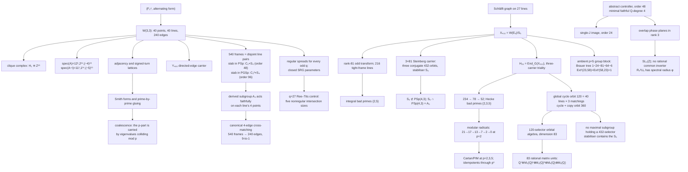

# W(3,3): the executable exceptional-geometry atlas

[](https://wilcompute.github.io/W33-Theory/)


[](LICENSE)

> **One finite geometry. Thousands of exact artifacts. Named maps. Reproducible certificates. Public corrections.**

Start with the symplectic space `F_3^4`. Its totally isotropic points and lines
form `W(3,3)`: 40 points, 40 lines, 240 incident point-pairs, and the
collinearity graph `SRG(40,12,2,4)`. This repository is the executable atlas
grown from that object: exact homology, integral lattices, modular
representations, error-correcting codes, Schläfli/E₆ carriers, Hecke algebras,
cycle and selector geometry, and finite transport systems.

This is not a pile of numerology organized by pass number. Its strongest line is
an object-level bridge: three 432-state carriers are explicitly identified with
directed Schläfli edges, mapped equivariantly into an 81-dimensional
constituent, resolved integrally by exact Smith forms, and followed through
their bad-characteristic extensions and Hecke corners. The corpus also keeps
the failed versions, so a correction has an executable owner instead of being
silently overwritten.

## What this is, stated positively

One finite object, pushed as far as exact computation goes. The mathematics below
is not conditional on anything:

- **Named theorems with machine-checkable witnesses** — the two-branch and
  k-branch gluing laws, the coalescence theorem, pencil rigidity, the all-`m`
  trace-valuation theorem at `q=3`, and one Smith-form theorem that unified two
  agents' independently built towers.
- **A complete modular picture of the literal 26-dimensional Hecke algebra** —
  decomposition and Cartan matrices at `p = 2,3,5`, projective indecomposable
  dimensions, Loewy and radical series, and primitive idempotent systems lifted
  through `p⁶`. The ambient group block has the cyclic-defect Brauer tree
  `1−24−81−64−6`; it is related to, but not identical with, the Hecke radical.
- **A separate, explicit selector orbital algebra** — the 120-selector action has
  83 orbitals and rational Wedderburn algebra
  `Q⁷ ⊕ M₂(Q)² ⊕ M₃(Q)³ ⊕ M₄(Q) ⊕ M₅(Q)`, realized by 83 exact matrix units.
- **Exact integral arithmetic of every eigenlattice** — Smith forms, discriminant
  identities, prime-by-prime gluing, and a rigidity theorem showing the gluing
  support is an invariant of the ring `Z[S]`, not of the matrix.
- **Canonical named maps, not matching integers** — every one of the 540 frames
  carries a *unique* `A₄`-equivariant cross-matching, and the 540 of them cover
  the 240 edges exactly 9-to-1.
- **An all-odd-`q` strongly regular family** — regular symplectic spreads form an
  exact two-intersection scheme with closed parameters and eigenvalues; the
  `q=27` Ree–Tits spread supplies a complete seven-weight, exactly 9-divisible
  `[730,5]₂₇` code, and four named `q=27` families have distinct complete spectra.
- **Three controller objects, finally separated** — the abstract controller has
  order 48 and minimal faithful rational degree 4, its canonical single-`J`
  image has order 24, and the overlapping rank-three carrier is the infinite
  arithmetic group `SL₃(Z)` with no rational common inverter.
- **Every quadratic intertwiner, then its symmetry type** — all 50 quadratic
  Hom maps from the signed-edge 90 are explicit and surjective. Their phase/outer
  action is exactly `16·1 ⊕ 16·sgn ⊕ 9·std` for `S₃`, which explains both the
  balanced `25+25` outer split and the `32+18` phase split.
- **A correction ledger with executable owners.** Refuted claims keep their
  failure certificates instead of being silently overwritten, and several were
  found by the authors auditing themselves.

**Where the boundary falls.** The finite mathematics is exact. The *physical*
readings — which combinatorial object is a generation, a coupling, an optical mode
— are `CONDITIONAL`, because identifying a combinatorial object with a physical one
is a map that must be built, not inferred from a matching integer. Two of fourteen
published constant formulas survive σ-testing, and the
[table showing which twelve fail](#physics-constants--every-derivation-verified-or-flagged)
is in this README rather than in a drawer. That is the standard the whole corpus is
held to, and it is the reason to trust the rest.

## What is already in hand

| Result family | Best current result | Canonical owner |
|---|---|---|
| Geometry, topology, and code | The canonical `W(3,3)` model, `H₁ ≅ Z^81`, and the ternary `[[240,81,3]]₃` sector | [master paper](w33_paper.pdf) · [Passes 373–374](PASS373_374_W33_BOUNDARY_MLUT_PHASE_SHEET_SYNTHESIS.md) |
| Integral spectral arithmetic | Exact adjacency and signed-turn Smith forms, prime-by-prime gluing, ramified kernel growth, and the coalescence theorem | [integral frontier](#eigenlattices-gluing-and-the-e₈-boundary--the-2026-07-arc) |
| Exceptional carrier bridge | `432 → 81 → 216`, one-colour Smith profile `1^15,2^6,4^8,8^29,40^23`, colour index `3^81` | [Pass 1147](PASS1147_SCHLAEFLI_STEINBERG_FOURIER_BRIDGE.md) |
| Modular representation closure | The nonsplit `58\|23` frame extension, one-dimensional directed `Ext¹` spaces, exact `H₂₆` radicals, Cartan matrices, PIM dimensions, and lifts through `p^6` | [Pass 1335](PASS1335_BRAUER_TREE_HECKE_CORNER.md) · [Passes 1340–1344](PASS1340_1344_CARTAN_ATLAS_SELECTOR_PADIC_RELEASE.md) |
| Global selector geometry | The length-4 simple-cycle orbit of size `120` is globally minimal over all lengths `3…40`; adding a primitive copy idempotent gives the global orbit minimum `360` | [GAP witness](analysis/w33_pass1342_global_cycle_selector_bound.g) |
| Selector orbital algebra | The 120-selector action has 83 orbitals, a 79-dimensional Terwilliger algebra, and 83 explicit rational Wedderburn matrix units | [Passes 1355–1384](analysis/BT1355_BT1359_selector_matching_scheme.md) |
| Steinberg carrier, named | The three 432-orbits carrying the `3×81` are **conjugate**, stabiliser `S₅`; the later refinement gives `S₅ ∩ PSp(4,3) = A₅` | [Pass 1134 owner](analysis/w33_pass1134_we6_432_stabilizers.py) · [Pass 1375 refinement](analysis/w33_pass1375_1378_s5_tomotope_a4_guard.md) |
| Frame cross-matching | Every frame has a unique collinearity transversal; independently it is the unique `A₄`-equivariant matching, and all 540 cover the 240 edges 9-to-1 | [Pass 1355 owner](analysis/BT1355_BT1359_selector_matching_scheme.md) · [Pass 1390 refinement](analysis/w33_pass1390_1391_frame_cross_matching.md) |
| Exact cover frontier | Two disjoint 100,000-cover searches hit the same 327 complete `PSp(4,3)` orbits, containing `3,547,800` covers in total; this is a certified lower bound, not a global completeness claim | [Pass 1510 audit](analysis/BT1510_bidirectional_cover_saturation.md) |
| Regular-spread family | For every odd prime power, the `q+1` intersection relation is an explicit SRG with eigenvalues `q(q−2),−q`; a `q=27` Ree–Tits slice already has five nonregular intersection sizes | [Passes 2200–2206](PASS2200_2206_ALL_Q_SPREADS_NONREGULAR_CONTROLLER_RTL_RELEASE.md) |
| Complete `q=27` spread spectra and codes | Ree–Tits has complete spectrum `1⁷³⁰,10⁴⁵⁶³,19⁹⁶¹⁷⁴,28⁴⁰⁸²⁹⁴,37³⁶⁵⁰⁴,46⁴⁹¹⁴,55⁷⁰²` and an exactly 9-divisible `[730,5]₂₇` code; regular/Kantor/Thas–Payne/Ree–Tits spectra are pairwise distinct | [Pass 2300](analysis/w33_pass2300_ree_tits_divisible_code.py) · [Pass 2304](analysis/w33_pass2304_known_q27_spread_spectra.py) |
| Controller representations | Abstract `(C₄×C₆):C₂` has order 48 and minimal faithful rational degree 4; the single-`J` image has order 24; the overlapping 3D carrier is `SL₃(Z)` and has no common inverter | [Pass 2306](PASS2306_CONTROLLER_REPRESENTATION_TRICHOTOMY.md) |
| Complete quadratic map module | Full `PSp(4,3)` Hom dimensions are `Sym=(3,6,5,12)`, `Λ=(3,4,5,12)` on targets `(15,24,30,81)`; the combined `S₃` module is `16·1⊕16·sgn⊕9·std` | [Pass 2301 bases](analysis/w33_pass2301_complete_quadratic_hom_bases.py) · [Pass 2307 character theorem](PASS2307_QUADRATIC_HOM_S3_DECOMPOSITION.md) |
| Canonical Weil outer action | At `q=7,11`, complex conjugation realizes the nonsquare outer similitude on both parity constituents and reverses the realified complex structure, giving exact `D₄` relations | [Pass 2302](analysis/w33_pass2302_q7_q11_weil_outer_inversion.py) |
| Chamber Hecke and chiral carrier | The two 160-chamber panels generate the 8D type-`C₂` Hecke image; `Ω` has a literal, uniformly isoclinic point/line `24+24` carrier with squared coupling `3/8` | [Passes 4324–4334](analysis/BT4324_BT4334_CHAMBER_HECKE_AND_AUDITED_CORRECTIONS.md) |
| Executable recursive runtime | HoloBox gives addressed mailbox/run, immutable path-copy checkpoints, one leaf/network loader, `4,201,025,641` level-six stateful VMs represented by seven uniform node blobs, and independent Python/GAP certificates | [runtime guide](docs/W33_FRACTAL_MICROVM_RUNTIME.md) · [evidence card](docs/holobox-fractal-microvm.html) |

Those are the compact front doors. The larger [certified backbone](#certified-finite-backbone)
below gives exact statements, tiers, and owning artifacts without forcing a
reader to guess which of several historical versions is strongest.

## Choose your route

| Reader | Start here | Then go deeper |
|---|---|---|
| General reader | [Live atlas](https://wilcompute.github.io/W33-Theory/) · [W33 for Everyone](W33_FOR_EVERYONE.pdf) | [Practical implications](docs/pdf/holonet_practical_implications.pdf) |
| Mathematician / researcher | [Master paper](docs/pdf/w33_paper.pdf) · [source](w33_paper.tex) | [Result index](RESULTS_INDEX.md) · [canonical vocabulary](RESULTS_VOCABULARY.md) |
| Reproducer / reviewer | [Reproduction commands](#reproduce-the-flagship-results) | [certificates](data/) · [tests](tests/) · [correction ledger](#things-we-got-wrong-on-purpose-and-in-public) |
| Lattice / deformation researcher | [Determinant-law paper](docs/pdf/heisenberg_weyl_determinant_law.pdf) | [eigenlattice table](#eigenlattices-gluing-and-the-e₈-boundary--the-2026-07-arc) |
| Photonic / systems reader | [Photonic Holonet](docs/pdf/photonic_holonet.pdf) · [source](photonic_holonet.tex) | [`HOLONET.md`](HOLONET.md); treat implementation claims as conditional |
| Runtime / distributed-systems builder | [HoloBox evidence card](docs/holobox-fractal-microvm.html) · [CLI](analysis/holobox.py) | [runtime guide](docs/W33_FRACTAL_MICROVM_RUNTIME.md) · [focused regression](tests/test_w33_fractal_microvm_runtime.py) |
| Assessing whether to fund this | [Machine blueprint](holonet_machine_blueprint.pdf), Part I | then **What is not built** and the **errata index**, both at the end of that document |

The corpus is too large to navigate by filenames. Search the **result itself**
in [`RESULTS_INDEX.md`](RESULTS_INDEX.md) before re-deriving it.

### The three manuscripts

All three share one reader convention: **cream** boxes are plain language, **blue** boxes
carry exact statements with scope, and **rose** boxes retain claims this project published
and then withdrew together with the measurement that overturned them. The machine blueprint
has full plain-language coverage; the two research atlases currently provide a reader guide
and selected plain-language entries, not a cream-box paraphrase of every section.

| Document | Pages | What it is |
|---|---:|---|
| [`holonet_machine_blueprint.tex`](holonet_machine_blueprint.tex) | 205 | A computer specified by the geometry — instruction set, gate counts, thermodynamics. Six parts, each opening in plain language. |
| [`w33_paper.tex`](w33_paper.tex) | 477 | The research atlas: everything established about `W(3,3)`, evidence-tiered. |
| [`photonic_holonet.tex`](photonic_holonet.tex) | 347 | One self-entangled photon as computer, network and clock. |

All three build with **zero errors and zero undefined references**, enforced in CI
(`.github/workflows/manuscripts-compile.yml`) — an undefined reference is only a *warning*
in LaTeX, so three of them once shipped through hundreds of clean builds.

### The finite ISA design space, in one table

Two independent asymmetries in the instruction set mean four possible machines, not one.
Reported together because no two are the same design and the prices do not substitute:

| machine | opcodes | p/f swap | mixing | ρ(B) | localisation peak | entropy production |
|---|---:|:---:|---:|---:|---:|---:|
| A — biased, irreversible (shipped) | 4 | no | 15 | 5.7469 | 0.6129 | infinite |
| B — symmetric, irreversible | 6 | yes | 12 | 8.7621 | 0.4604 | infinite |
| C — biased, reversible | 8 | no | 16 | 5.7469 | 0.6129 | 0 |
| D — symmetric, reversible | 12 | yes | 13 | 8.7621 | 0.4604 | 0 |

C shares A's spectrum *exactly*: closing an instruction set under inverses adds no new
undirected edges, so it changes directed thermodynamic bookkeeping without changing that
simple graph. Exact conjugation by the p/f pair swap proves B and D are symmetric and A and
C are not. Machine D therefore removes both named asymmetries in the finite model. Its
0.4604 peak is symmetric within-pair localisation, not residual p/f bias. These rows are
analytic opcode/graph measurements; only A/C have earlier generic-cell synthesis, so B/D
hardware pricing remains open.

### Latest exact closure: the chamber Hecke machine

The 160 W(3,3) chambers carry two native three-way switches: change the line at a fixed
point (`P`) or the point on a fixed line (`L`). GAP proves

\[
P^2=2P+3I,\qquad L^2=2L+3I,\qquad PLPL=LPLP,
\]

and the generated algebra has dimension 8: the full q=3 type-C2 Iwahori–Hecke image. In
the 320-state oriented Levi basis,

\[
B_{\rm Levi}=\begin{pmatrix}0&L\\P&0\end{pmatrix},
\qquad B_{\rm Levi}^2=\operatorname{diag}(LP,PL).
\]

The chirality `Ω=LP−PL` has rank 48 and exact projector `Π₄₈=−Ω²/60`; on that packet,
`Ω/√60` is a complex structure. The old folded cubic now has the exact normal form

\[
F=-68\Pi_{48}-31X-\frac{21}{2}\Omega+\frac23X\Omega,
\qquad (F+68\Pi_{48})^2=-689\Pi_{48}.
\]

Pass 4334 makes the `24+24` count literal. Lift the eigenvalue-2 projectors of the W33
point graph and dual line graph to chamber projectors `Qₚ,Qℓ`. Their rank-24 images meet
only in zero and span `im Π₄₈`; moreover

\[
Q_pQ_\ell Q_p=\frac38Q_p,\qquad
Q_\ell Q_pQ_\ell=\frac38Q_\ell.
\]

All 24 principal angles therefore have cosine `√6/4`, and for `Q=Qₚ+Qℓ` the orthogonal
span projector is `Π₄₈=(8/5)(2Q−Q²)`. The conjugate packet is exactly the joined point and
line eigencarriers, not merely a matching dimension count.

Reproduce it with [the GAP witness](analysis/w33_pass4324_4327_chamber_hecke_hashimoto.g)
and [focused regression](tests/test_w33_pass4324_4327_chamber_hecke_hashimoto.py), plus the
[Pass-4334 carrier witness](analysis/w33_pass4334_point_line_chiral_carrier.g) and
[regression](tests/test_w33_pass4334_point_line_chiral_carrier.py). The
operators are exact finite relations; a deterministic three-way selector and synthesized
chamber datapath are not yet built.

### HoloBox: a recursive network that executes as one VM

[`analysis/holobox.py`](analysis/holobox.py) now turns the 40-ary Holonet law into
an executable, immutable runtime object. A leaf VM and a network of 40 child VMs
use the same state media type and loader. More importantly, the identity is
operational: address a nested guest, route it a mailbox value, execute it, and
checkpoint the result by replacing only the digests on that one path.

At six levels, a uniform HoloBox denotes `105,025,641` internal network VMs plus
`4,096,000,000` addressable leaf VMs: `4,201,025,641` stateful VMs represented by
only seven unique node blobs. In the frozen fresh transition, a depth-six
delivery creates seven path-state blobs plus one receipt; recipient execution
creates seven path-state blobs. These are upper bounds for arbitrary writes,
because a content-identical replay may allocate no new CAS key. Untouched
sibling digests remain byte-identical. Recursive routes use no stored
next-hop table and take at most two W33 line transactions per radix-40 address
digit. This `2n` logical metric is distinct from BT827's `8n` chart-aware
lowering (`3` cube + `5` chart-web moves per digit). The frozen Python reference
witness is **19/19 PASS**, with an independent **7/7 GAP** route certificate.

```console
python3 analysis/holobox.py build --output /tmp/holobox --levels 6 \
  --program RECV,HALT
python3 analysis/holobox.py send /tmp/holobox --source 0/0/0/0/0/0 \
  --target 3/10/17/24/31/38 --message 13 --output /tmp/holobox-message
python3 analysis/holobox.py run /tmp/holobox-message --address 3/10/17/24/31/38 \
  --commit /tmp/holobox-run
python3 analysis/holobox.py verify /tmp/holobox-run
```

BT339 owns the earlier `2n` hierarchy assertion, BT350 the nested-VM framing,
Passes 2642--2644 the same-port recursive hardware module, and the older Witting
architecture the CID-container, WASM/OCI, policy, receipt, and Projection Engine
design. HoloBox implements the previously missing nested lifecycle and content
graph; it does not claim those earlier ideas. Its bundle is **OCI-shaped, not yet
OCI-conformant**, and the Python model
is not Linux/KVM isolation, a guest kernel, confidential-computing attestation,
or a performance result. See the [runtime guide](docs/W33_FRACTAL_MICROVM_RUNTIME.md),
[19-check certificate](data/w33_fractal_microvm_runtime.json), and
[GAP route witness](analysis/w33_fractal_microvm_routing.g).

### Current correction ledger

- Pass 4253's Z₍₂₇₃₁₎ lift has an explicit zero-voltage eight-cycle, hence girth exactly 8,
  not at least 16. The valid current high-girth construction is the much larger Pass 4261
  Z₍₇₅₀₀₁₉₎ lift.
- The irregular Kotani–Sunada non-real-pole annulus has square roots. The former
  no-square-root “band filling”/“closest irregular Ramanujan” score is withdrawn.
- Affine translations act on 81 frames but descend to neither projective 40-carrier; they
  do not force a point-side projective load port.
- Pass 4331's linear-opcode mismatch incidence census detects 1656/1920 = 69/80
  differential rail substitutions and 0/960 shared-control substitutions. It is narrower
  than the Pass 4367/4374 intrinsic flag-register comparator, which detects 36/39 = 12/13
  arbitrary one-register substitutions at q=3. The former 95.71% result used a golden run.
- The complete universal-set census is 360, and the shipped ISA is tied 7th–12th by the
  reported ρ value, not strictly 12th.

The exact correction witness is
[Passes 4328–4333](analysis/w33_pass4328_4333_audited_corrections.g); the readable evidence
map is [here](analysis/BT4324_BT4334_CHAMBER_HECKE_AND_AUDITED_CORRECTIONS.md).

## Evidence tiers

| Tier | What it means |
|---|---|
| `PROVED` | A mathematical proof or named formal theorem. If Lean-owned, build the specific module; do not infer a green library from a file's existence. |
| `CERTIFIED` | Exact computation with a deterministic witness, certificate, and focused test. |
| `CONDITIONAL` | The finite mathematics is sound; an interpretation or implementation map is still missing. |
| `OPEN` | A precise question with no completed witness. |
| `RETRACTED` | Previously promoted, then refuted; retained with the failure certificate. |

## Canonical objects: names that must not be conflated

| Name | Canonical meaning |
|---|---|
| `Γ = W33` | The graph obtained from symplectic orthogonality on `PG(3,3)`, not an arbitrary `SRG(40,12,2,4)`; 28 graphs share the parameters. |
| `G₀` | `PSp(4,3)`, order `25,920`, the inner projective symmetry. |
| `G = Aut(Γ)` | `PGSp(4,3) ≅ W(E6)`, order `51,840`. The same-order group `Sp(4,3)` is a central double cover, not this faithful projective action. |
| `H₁(Γ)` | `Z^81`, the first homology of the clique complex. |
| `Y₄₈₀` | The 480 directed edges of `W33`, carrying the signed-turn operator `K`. |
| `X₄₃₂` | `W(E6)/S5`, equivalently the directed edges of the Schläfli graph. |
| `81₋` | The Pass-1147 constituent in `Λ²(Aug(Q^27))`; it is not silently identified with `H₁(Γ)`. |
| `H₂₆` | `End_G(X₄₃₂)`, the literal 26-dimensional coset Hecke algebra. |
| Selector orbital algebra | `End_H(Q^120)`, dimension 83; its 83 rational matrix units do **not** belong to `H₂₆`. |
| `Γctrl` | The abstract independent-clock group `(C₄×C₆):C₂`, order 48, requiring two complex phase registers for faithfulness over `Q`. |
| `ΓJ` | The canonical single-`J` quotient `C₁₂:C₂`, order 24; kernel `⟨(2,3,0)⟩`. |
| Arithmetic phase carrier | The overlapping three-coordinate action `⟨R₄,U₆⟩=SL₃(Z)`; infinite and not a smaller representation of `Γctrl`. |

For aliases, superseded names, and pass ownership, use
[`RESULTS_VOCABULARY.md`](RESULTS_VOCABULARY.md),
[`data/ALIAS_REGISTRY.json`](data/ALIAS_REGISTRY.json), and
[`data/w33_pass_namespace_registry_v2.json`](data/w33_pass_namespace_registry_v2.json).

## Certified finite backbone




| Mathematical object | Strongest current result | Tier | Canonical entry |
|---|---|---|---|
| Symplectic quadrangle | `SRG(40,12,2,4)`, spectrum `12^1,2^24,(−4)^15`, `Aut ≅ W(E6)` | `PROVED` | [master paper](w33_paper.pdf) |
| Clique complex | `H₁ ≅ Z^81`; qutrit CSS sector `[[240,81,3]]₃` with `(d_X,d_Z)=(3,4)` | `CERTIFIED` | [Passes 373–374](PASS373_374_W33_BOUNDARY_MLUT_PHASE_SHEET_SYNTHESIS.md) |
| Integral adjacency | `SNF(A)=diag(1^16,2^8,8^15,24)`; saturated gluing `(Z/2)^6⊕(Z/6)^9⊕Z/120` | `CERTIFIED` | [`pass827`](analysis/w33_pass827_adjacency_kbranch_meets_e8_boundary.py) |
| Ramified gluing | Kernel growth `40,80,119,158,182` reconstructs `Z/8⊕(Z/2)^15` at `p=2` | `CERTIFIED` | [Pass 1002 release](analysis/BT999_1003_five_frontier_release.md) |
| Signed directed edges | `spec(K)=(−6)^81,2^120,4^24,10^15`; exact four-branch gluing | `CERTIFIED` | [`pass826`](analysis/w33_pass826_k_operator_four_branch_gluing.py) |
| Schläfli/E₆ carrier | `X₄₃₂` maps with rank 81 to 216 antipodal tight-frame lines; three colours give rank 243, and adjoining the disjoint rank-45 cubic block gives rank 288 with residual 1952 | `CERTIFIED` | [Pass 1147](PASS1147_SCHLAEFLI_STEINBERG_FOURIER_BRIDGE.md) |
| Integral Schläfli frame | Smith profile `1^15,2^6,4^8,8^29,40^23`; internal bad primes `{2,5}`; colour split index `3^81` | `CERTIFIED` | [Pass 1147](PASS1147_SCHLAEFLI_STEINBERG_FOURIER_BRIDGE.md) |
| Saturated frame mod 5 | Nonsplit `0→I₅₈→S₅→K(W33)₍₅₎⊗sgn→0`; `Ext¹(23,58)=Ext¹(58,23)=1` over both groups, so this is the unique nonzero extension type up to endpoint rescaling | `CERTIFIED` | [Pass 1147](PASS1147_SCHLAEFLI_STEINBERG_FOURIER_BRIDGE.md) · [Pass 1335](PASS1335_BRAUER_TREE_HECKE_CORNER.md) |
| Three-carrier Hecke/triality | Commutants `234 → 78 → 52`; six-channel SNF `1,1,1,12,12,24`; Hecke bad primes `{2,3,5}`; invariant cycles do not select a copy | `CERTIFIED` | [Passes 1325–1329](PASS1325_1329_TRIALITY_INTEGRAL_GAUGE_RELEASE.md) |
| Modular `H₂₆` | Radical powers at `p=2,3,5` are `21,17,13,7,2,0`; `22,16,10,4,0`; `6,2,0`; the exceptional `p=5` scalar Ext quiver is doubled `A₃`, a condensation shadow of the same cyclic-defect block | `CERTIFIED` | [Passes 1330–1334](PASS1330_1334_MODULAR_TRIALITY_ATLAS_RELEASE.md) · [Pass 1335](PASS1335_BRAUER_TREE_HECKE_CORNER.md) |
| Rational degree-20 model | Exact `20×20` rational standard generators satisfy `C²=D⁹=(CD)¹⁰=I`; GAP affords faithful images of order `51,840` and uniquely matches CTblLib row 11. The reported literal-480 derivation remains provenance, not rebuilt here. | `CERTIFIED` | [Pass 1341 analysis](analysis/BT1340_BT1344_cartan_atlas_selector_padic.md) |
| Binary quadratic-residue code | Corrected code `[[137,1,21]]`; exact affine/real-Clifford towers and explicit parity boundaries | `CERTIFIED` | [Passes 358–367](PASS363_367_QR_CLIFFORD_REFINEMENT_SYNTHESIS.md) |
| Section trace tower | For every `m≥2`, `min_c v_λ(tr(D_c^m)) = 2(m+[m odd])` at `q=3` | `CERTIFIED` | [Pass 541](PASS541_Q3_ALL_M_RECURRENCE_THEOREM.md) |
| `H₂₆` Cartan/PIM and p-adic refinement | `C₂=diag(1,22)`, `C₃`, `C₅=I₆⊕[[2,1,1],[1,1,0],[1,0,2]]`; PIM dimensions `(2,22)`, `(9,6,10,1)`, `(3,2,1,1,1,1,4,2,3)`; primitive systems verified through `p⁶`; Smith and Loewy filtrations differ | `CERTIFIED` | [Passes 1340–1344](PASS1340_1344_CARTAN_ATLAS_SELECTOR_PADIC_RELEASE.md) |
| Global cycle/copy selector bound | Exact GAP path-stabilizer proof: global simple-cycle orbit minimum `120` at length 4; a primitive copy idempotent gives `360`; cycles alone act as `C⊗I₃` | `CERTIFIED` | [GAP witness](analysis/w33_pass1342_global_cycle_selector_bound.g) |
| Shifted adjacency | `spec(A−I) = 11¹,1²⁴,(−5)¹⁵`, `m_D(t)=(t−11)(t−1)(t+5)`; the historical cubic `(t+1)[(t+1)²−36]` annihilates **no** eigenspace (`rank p_old(D)=40`) | `CERTIFIED` | [erratum](analysis/2026-07-27_shifted_adjacency_spectral_erratum.md) |
| Steinberg carrier stabiliser | Three **conjugate** 432-orbits, stabiliser `S₅ = SmallGroup[120,34]`; the later refinement gives `S₅ ∩ PSp(4,3) = A₅` and the maximal-subgroup obstruction | `CERTIFIED` | [Pass 1134 owner](analysis/w33_pass1134_we6_432_stabilizers.py) · [Pass 1375 refinement](analysis/w33_pass1375_1378_s5_tomotope_a4_guard.md) |
| Tomotope, from its own paper | `Γ(T)=[96,227]=2⁴:S₃`, `Γ(T)′=[48,50]=2⁴:C₃`, built from the **published** generators. `Aut(T)` *satisfies* the intersection condition — `Mon(T)` is what fails | `CERTIFIED` | [Pass 1376](analysis/w33_pass1375_1378_s5_tomotope_a4_guard.md) |
| Frame cross-matching | Pass 1355 owns the unique collinearity transversal; Pass 1390 independently characterizes it as the unique `A₄`-equivariant bijection and proves uniform 9-to-1 coverage | `CERTIFIED` | [Pass 1355 owner](analysis/BT1355_BT1359_selector_matching_scheme.md) · [Pass 1390 refinement](analysis/w33_pass1390_1391_frame_cross_matching.md) |
| Frames are not polytope facets | `O_h` is a string C-group `{4,3}`, but no rank-4 string C-group extends it in `PSp(4,3)` | `CERTIFIED` | [Pass 1377](analysis/w33_pass1375_1378_s5_tomotope_a4_guard.md) |
| Exact-cover orbit frontier | Two disjoint deterministic prefixes independently hit the same 327 complete `PSp(4,3)` orbits, whose sizes sum to `3,547,800`; global completeness remains open | `CERTIFIED` | [Pass 1510 audit](analysis/BT1510_bidirectional_cover_saturation.md) |
| All-odd-`q` regular-spread graph | `v=q²(q²−1)/2`, `k=q(q−2)(q²+1)/2`, `λ=q(q³−4q²+7q−8)/2`, `μ=q(q−2)(q−1)²/2`; nontrivial eigenvalues `q(q−2),−q` | `PROVED / CERTIFIED` | [Passes 2200–2206](PASS2200_2206_ALL_Q_SPREADS_NONREGULAR_CONTROLLER_RTL_RELEASE.md) |
| Controller representation trichotomy | Finite abstract order 48 / canonical order 24 / infinite `SL₃(Z)` are distinct; minimal faithful rational degree 4 and common-inverter nullity 0 | `CERTIFIED` | [Pass 2306](PASS2306_CONTROLLER_REPRESENTATION_TRICHOTOMY.md) |
| Complete `q=27` named-family codes | All four standard coordinate families have hyperplane sections `1 mod 9`; the regular code is 27-divisible `[730,4]₂₇`, while three nonregular codes are exactly 9-divisible `[730,5]₂₇` | `CERTIFIED` | [Pass 2304](analysis/w33_pass2304_known_q27_spread_spectra.py) |
| Complete quadratic Hom bases | Every nonzero basis map is target-surjective; full dimensions total `26` symmetric and `24` alternating, with outer-even and outer-odd halves both dimension 25 | `CERTIFIED` | [Pass 2301](analysis/w33_pass2301_complete_quadratic_hom_bases.py) |
| Quadratic Hom `S₃` character | `Sym=13·1⊕3·sgn⊕5·std`, `Λ=3·1⊕13·sgn⊕4·std`, combined `16·1⊕16·sgn⊕9·std`; explains `25+25` and `32+18` | `CERTIFIED` | [Pass 2307](PASS2307_QUADRATIC_HOM_S3_DECOMPOSITION.md) |

### The flagship bridge, in one paragraph

Each of the three 432-state A₂ colours is the directed-edge set of
`SRG(27,16,10,8)`. GAP constructs the explicit odd transform into `81₋`;
its 432 vectors form 216 antipodal lines with `G²=3200G` and angles
`0,1/15,1/5`. One colour has Smith profile
`1^15,2^6,4^8,8^29,40^23`; the three-colour Fourier split adds index
`3^81`. Modulo 5, the saturated 81-space is not `58⊕23`: it is the nonsplit
length-two module
`0→I₅₈→S₅→K(W33)₍₅₎⊗sgn→0`, with a unique proper nonzero submodule.
Pass 1335 identifies the cyclic-defect Brauer tree and proves both directed
cross-`Ext¹` spaces have dimension one, so this nonsplit module exhausts the
previously open extension class. The Hecke radical records a condensed
doubled-`A₃` shadow; it is not the module itself.
The next algebra layer is explicit as well: Pass 1340 computes the Cartan and
projective-indecomposable data at `2,3,5`, while Pass 1343 lifts complete
primitive systems through `p^6` and proves that the Smith and Loewy filtrations
are genuinely different. Separately, GAP proves that the `120`-element
length-4 cycle orbit is globally minimal, so selecting one of the three
species-20 copies costs a minimum orbit `360`; this quantifies a gauge choice
without pretending the choice is canonical.
This is an exact theorem about named `W(E6)` modules and integral lattices. It
does not identify generations, Yukawa couplings, particles, or optical modes.

## Find the canonical result, not the newest filename

1. Search a formula, integer sequence, or code parameter in
   [`RESULTS_INDEX.md`](RESULTS_INDEX.md).
2. Resolve aliases and retractions in
   [`RESULTS_VOCABULARY.md`](RESULTS_VOCABULARY.md) and
   [`data/ALIAS_REGISTRY.json`](data/ALIAS_REGISTRY.json).
3. Open the owning synthesis, then the executable witness and JSON certificate.
4. Run the focused test. A later pass that repeats the number is not a new owner.

Every promoted bridge should name its source object, target object, and map.
Matching dimensions or group orders are evidence to investigate, not maps.

---

## The derivations, symbolically

The finite-geometry tables immediately below are derived from
`(q, k, λ, μ) = (3, 12, 2, 4)` and the graph itself. Later sections explicitly
name any additional representation-theory, coding-theory, experimental, or
interpretive input. **Status** is honest:
`PROVED` = machine-checked or proved in the paper; `CERTIFIED` = exact computation with an idempotent JSON
certificate; `OPEN` = stated, not settled; `RETRACTED` = we published it, then killed it.

### Geometry and spectrum

| Quantity | Symbolic derivation | Value | Status | Witness |
|---|---|---|---|---|
| Eigenvalues `r, s` | `r,s = ½[(λ−μ) ± √((λ−μ)² + 4(k−μ))]` | `2, −4` | PROVED | SRG theory |
| Spectral gap `r−s` | `√((λ−μ)² + 4(k−μ)) = √36` | `6` | PROVED | ” |
| Multiplicities `f, g` | `f,g = ½[(n−1) ∓ (2k+(n−1)(λ−μ))/(r−s)]` | `24, 15` | PROVED | ” |
| Edge count | `nk/2 = 40·12/2` | `240` | PROVED | ” |
| Ramanujan bound | `\|λ_nontrivial\| ≤ 2√(k−1) = 2√11 ≈ 6.633` | `4 ≤ 6.633` ✓ | PROVED | `w33_paper.tex` |
| `H_1` of clique complex | `dim = \|E\| − rank d₁ − rank d₂ = 240−39−120` | `Z^81` | CERTIFIED | `w33_pass682_*` |

### The Ihara zeta and its zeros

| Quantity | Symbolic derivation | Value | Status |
|---|---|---|---|
| Zero locus | roots of `1 − λu + (k−1)u² = 0`, per eigenvalue `λ` | — | PROVED |
| Zero radius | `\|u\| = 1/√(k−1)` | `1/√11 ≈ 0.3015` | PROVED |
| Zero phase | `φ = arccos( λ / (2√(k−1)) )` | — | PROVED |
| Gauge phase | `φ_g = arccos(2/2√11) = arctan√Φ₄(3)`, `Φ₄(3)=3²+1` | `72.45°` | PROVED |
| Chiral phase | `φ_c = arccos(−4/2√11)`, involves `Φ₆(3)=3²−3+1` | `127.09°` | PROVED |
| Graph RH ⟺ Ramanujan | standard equivalence (Terras) — **not new** | — | PROVED |

*The `72.45°` and `127.09°` phases are real, exact, and were in `w33_paper.tex` before three separate
"discoveries" of them. See the retractions.*

### Eigenlattices, gluing, and the E₈ boundary — the 2026-07 arc

This is the newest frontier and the one with live theorems. `L_c = ker(A − cI)` denotes a **saturated**
eigenlattice.

| Quantity | Symbolic derivation | Value | Status | Witness |
|---|---|---|---|---|
| Two-branch gluing | `S(S−cI)=0`, `S=[[cI,Y],[0,0]]` ⟹ `Z^n/(L_c⊕L_0) ≅ ⊕ᵢ Z/(c/gcd(dᵢ,c))`, `dᵢ = Smith(Y)` | — | PROVED | `pass806` + Lean |
| k-branch gluing | `Nᵢ=∏_{j≠i}(S−c_j)`, `Dᵢ=∏_{j≠i}(cᵢ−c_j)` ⟹ `Z^n/⊕Lᵢ = Z^n/⋂ᵢ ker(Nᵢ mod Dᵢ)` | — | CERTIFIED | `pass809` |
| **Coalescence theorem** | for `v_p(M)=1`, `M=lcm(Dᵢ)`: p-part `= (Z/p)^{r_p}`, `r_p = rank_{F_p}` of the `Nᵢ` with `p∣Dᵢ`; and `p∣Dᵢ ⟺ cᵢ≡c_j (mod p)` | — | CERTIFIED | `pass828` |
| ⤷ in words | **the p-part is carried entirely by eigenvalues that collide mod p** | — | ” | ” |
| Adjacency 3-branch gluing | `Z^40/(L₁₂⊕L₂⊕L₋₄)` | `(Z/2)⁶⊕(Z/6)⁹⊕Z/120` | CERTIFIED | `pass827` |
| ⤷ primary form | — | `(Z/2)¹⁵⊕Z/8⊕(Z/3)¹⁰⊕Z/5` | ” | ” |
| Collision structure | `{12,2,−4}` ≡ `{12},{2,−4}` mod 3; `{12,2},{−4}` mod 5 | ranks `10`, `1` | CERTIFIED | `pass828` |
| `K` four-branch gluing | `Z^240/⊕Lᵢ`, spectrum `{−6,2,4,10}` | `(Z/32)¹⁴⊕(Z/8)⊕(Z/4)⁶⁶⊕(Z/2)²³⊕(Z/3)¹⁰⊕(Z/5)²³` | CERTIFIED | `pass826` |
| Discriminant identity | `∏ᵢ det(Lᵢ) = [Z^n : ⊕Lᵢ]² = \|gluing\|²` | `2³⁶·3²⁰·5²` ✓ | CERTIFIED | `pass829` |
| `det(L₂)` | Gram determinant of the `+2`-eigenlattice | `2¹⁶·3¹⁰·5` | CERTIFIED | ” |
| `det(L₋₄)` | forced by the identity; **not in the paper** | `2¹⁷·3¹⁰` | CERTIFIED | ” |
| `L₂` discriminant group | `L₂^#/L₂` | `(Z/2)¹⁶⊕(Z/3)¹⁰⊕Z/5` | PROVED | `w33_paper.tex` |
| **Rigidity** | `(a−b) ∣ f(a)−f(b)` ∀`f∈Z[x]` ⟹ collisions are **functorial** ⟹ gluing support is an invariant of `Z[S]`, not `S` | — | PROVED | `pass876` |
| ⤷ consequence | eigenlattices split ⟺ gap is a unit; adjacency gaps are `10,16,6` ⟹ **no `f(A)` splits `Z^40`** | — | PROVED | ” |
| Coalescence = p-rank | for an `{r,s}` collision, `r_p = rank_{F_p}((A−kI)(A−rI))` — a **classical SRG p-rank** | — | CERTIFIED | `pass983` |
| Gluing ≻ spectrum | on cospectral `T(8)` / Chang: `(Z/2)⁶⊕Z/4` vs `(Z/2)⁷⊕Z/4` — **separates them** | — | CERTIFIED | `pass984` |
| Signed edge action | `Aut` acts on *oriented* edges by **signed** permutations; commutes with `K` (8/8) | — | CERTIFIED | ” |

### The flat block (Heisenberg–Weyl track)

| Quantity | Symbolic derivation | Value | Status |
|---|---|---|---|
| Flat-block quadratic | `F² + 2F − (q²−1)I = 0` | eigenvalues `−1±q`, gap `2q` | PROVED |
| Order bridge | `S = F + (q+1)I` ⟹ `S² − 2qS = 0` | node, branches `{0,2q}` | PROVED |
| Abstract Ext quiver | over `Z_p`: `(Ext¹_self, Ext¹_cross, Ext²_self, Ext²_cross)` | `(0, Z/p^{v_p(2q)}, Z/p^{v_p(2q)}, 0)` | PROVED |
| `q=2` fibre = S8 commutant | `Z₂[S]/(S²−4S)`, `Ext = Z/4`, Kuranishi cone `xy=0` | — | PROVED |
| Key congruence | `F ≡ −I (mod q)` | verified `q ≤ 13` | CERTIFIED |
| Real gluing | `Z^n/(L_{q−1}⊕L_{−(q+1)}) = im((F+(q+1)I) mod 2q)` | `(Z/2)^{(q−1)²/2}` | CERTIFIED |
| ⤷ at `q=3,5,7` | — | `(Z/2)², (Z/2)⁸, (Z/2)¹⁸` | CERTIFIED |
| Burnside orbit count | `\|Fix_all(g)\| = (pⁿ)^{c⁺(g)}`, `\|SL(2,Z/pⁿ)\| = p^{3n−2}(p²−1)` on `(p^{2n}−1)/2` pairs | all odd `Z/pⁿ` | PROVED |
| ⤷ exact values | `F_3 → 7`; `F_5 → 2,034,735`; `Z/9 → 228100045392509153077600971330057241` | — | CERTIFIED |

### The physics chain — seven steps from a finite geometry

This is the program's most ambitious arc and its most contested. **Every row's arithmetic is exact and
verified; the physical *interpretation* of each is `CONDITIONAL`** — the identification of a combinatorial
object with a physical one is a map that must be built, not inferred from a matching integer. Read the
[retractions](#things-we-got-wrong-on-purpose-and-in-public) alongside this table.

| Step | Symbolic identity | Reading | Status |
|---|---|---|---|
| **1. Geometry** | `W(3,3) = ` isotropic points/lines of `(F_3^4, ω)` | the substrate; no free parameters | PROVED |
| **2. Homology** | `H_1(clique complex) = Z^81`, `81 = 3^4` | "homology reveals matter" | PROVED / CONDITIONAL |
| **3. Vertex split** | `40 = 1 + 24 + 15` (eigenvalue multiplicities) | `1` vacuum, `24 = dim adj SU(5)`, `15` Weyl spinors/generation | CERTIFIED / CONDITIONAL |
| **4. Generations** | `240 = 40 × 3 × 2`: each `K_4` line has `3` perfect matchings (labelled by `GF(3)`), each `2` edges | three generations from `|GF(3)|` | PROVED / CONDITIONAL |
| ⤷ refined | `240 = 72 + 6 + 81 + 81 = 3 × (24 + 2 + 27 + 27)`, per-generation `80 = 4+4+36+36` | `Sp(4,3)` is edge-transitive — a single orbit | CERTIFIED |
| **5. Gauge group** | `k = (k−μ) + q + 1 = 8 + 3 + 1 = 12` | `dim SU(3)=8`, `dim SU(2)=3`, `dim U(1)=1` | CERTIFIED / CONDITIONAL |
| ⤷ forced identity | `2q = λ + μ` (`6 = 2+4`) holds automatically for `W(q,q)` | the split is not chosen | PROVED |
| **6. Matter sector** | `v − 1 − k = 40 − 1 − 12 = 27` | fix a vacuum vertex: `27` non-neighbours carry `E_6` fundamental, since `\|Aut\| = 51,840 = \|W(E_6)\|` | CERTIFIED / CONDITIONAL |
| ⤷ branching | `27 = 16 + 10 + 1` under `E_6 ⊃ SO(10) ⊃ SU(5)` | one generation + Higgs + singlet | PROVED (rep theory) |
| **6b. E₈ boundary** | `240 = \|Φ(E_8)\|` | The global W33-edge map is obstructed; the distinct `40×3×2` local-axis endpoint carrier has an explicit integral lift onto all 240 signed roots; a different transitive subgroup embedding remains open | CERTIFIED / OPEN ([local-axis lift](PASS123_W33_AXIS_GLUE_E8_LIFT.md)) |
| **7. Curved 4D** | `KO-dim = 6 = 2q` (Connes–Barrett) | 4D spacetime as a derived quantity | CONDITIONAL |
| **α (fine structure)** | Hashimoto operator `B` on `480 = 2×240` directed edges | a spectral identity on the non-backtracking carrier, not a fit | CONDITIONAL |
| **Koide / flavour** | residual packet `98 · 17 · 208`, `208 = 4·dim(F_4) = 4·52` | factor arithmetic closed; physical identification open | OPEN |
| **CKM from Ihara phases** | `δ_CP ≟ φ_gauge = 72.45°` | **REFUTED** — see below | RETRACTED |

The honest summary of this arc: the *decompositions* are exact and the group theory is real. Whether
`24 = dim adj SU(5)` is physics or coincidence is exactly the kind of claim this repository has learned to
tier rather than assert.

### Physics constants — every derivation, verified or flagged

The repository contains **50+ constant tables** of varying quality. This one is built by *evaluating every
closed form* and comparing against PDG-2025 in **experimental σ**, not percent. Two things follow, and both
matter more than any individual row.

**First: of the 14 closed forms in the most-cited ledger, only 5 evaluate to their own stated value.** The
numbers may well be right; the formulas as written are not. A reader who checks will find this in minutes, so
it is recorded here rather than reproduced.

| Observable | Closed form as written | Evaluates to | Claimed | PDG-2025 | σ | Verdict |
|---|---|---:|---:|---|---:|---|
| `N_ν` | `q` | **3** | 3 | 3 (exact) | — | ✅ **exact** |
| `sin²θ₂₃` (PMNS) | `7/13` | **0.53846** | 0.5385 | 0.546 ± 0.021 | 0.4 | ✅ **agrees** |
| `m_t` (pole) | `v_EW/√2` | **173.948 GeV** | 173.95 | 172.57 ± 0.29 | 4.8 | ⚠️ formula OK, value excluded |
| `sin²θ_W` (dressed) | `q/(q²+q+1) = 3/13` | **0.230769** | 0.23077 | 0.23122 ± 0.00003 | 15.0 | ⚠️ formula OK, value excluded |
| `α⁻¹` (integer skeleton) | `k² − (\|r\|+\|s\|+1) = 144−7` | **137** | 137 | 137.035 999 178(8) | — | ✅ integer only; the `.036` is *not* derived |
| `\|V_us\|` | `√(3/v)·k` | **3.286** | 0.2253 | 0.2245 ± 0.0008 | — | ❌ formula ≠ claim |
| `m_H` | `1/(q⁻⁵) = q⁵` | **243** | 125.0 | 125.25 ± 0.17 | — | ❌ formula ≠ claim |
| `m_W` | `v_EW√((1−3/13)/2)` | **152.56** | 80.44 | 80.369 ± 0.013 | — | ❌ formula ≠ claim |
| `H₀` | `12/q!` | **2.0** | 67.0 | 67.4 ± 0.5 | — | ❌ formula ≠ claim |
| `n_s` | `1 − 2/(q·q)` | **0.7778** | 0.9667 | 0.965 ± 0.004 | — | ❌ formula ≠ claim |
| `Ω_Λ` | `1 − 1/(k·Φ₄/10)` | **0.9167** | 0.6833 | 0.685 ± 0.007 | — | ❌ formula ≠ claim |
| `sin²θ₁₂` (PMNS) | `3/(4·13) = 3/52` | **0.05769** | 0.3077 | 0.307 ± 0.013 | — | ❌ formula ≠ claim |
| `sin²θ₁₃` (PMNS) | `3/(6·29)` | **0.01724** | 0.02198 | 0.0220 ± 0.0007 | — | ❌ formula ≠ claim |
| `α⁻¹` (ledger form) | `k² + (k−1)² + λ` | **267** | 137.036 | 137.036 | — | ❌ formula ≠ claim |

**And most of the broken rows cannot be repaired.** Searching 7,128 expressions built from eighteen
W(3,3) atoms, four targets — `m_H`, `Ω_Λ`, `sin²θ₁₃` and `m_W/v_EW` — are reached by *nothing at all*, so
they should be **withdrawn**, not rewritten. The rest do have hits, but 36 hits for `sin²θ₁₂` is what chance
gives in a space that size: a hit found by search is a candidate for a derivation, not a derivation.
([`pass1010`](analysis/w33_pass1010_constant_rederivation_and_rank_bound.py))

**Second: even the formulas that evaluate correctly are mostly excluded by experiment.** `sin²θ_W` is 15σ
from the measured value and `m_t` is 4.8σ. Exactly two rows survive both tests — `N_ν = q = 3`, and
`sin²θ₂₃ = 7/13` at 0.4σ. That is the honest state of the constant program: one exact integer count, one
genuine agreement, and a great deal that needs its formulas re-derived before it can be called a derivation.

The combinatorial identities in the [physics chain](#the-physics-chain--seven-steps-from-a-finite-geometry)
above are a different matter — those are exact and verified. The gap is between *counting the geometry*,
which works, and *predicting a dimensionful constant*, which so far does not.

### A verified structural result: E₈ inside W(3,3)

Not a constant, but the strongest physics-adjacent claim that survives checking. The eight vertices
`[7, 1, 0, 13, 24, 28, 37, 16]` induce a subgraph of `W(3,3)` that **is the E₈ Dynkin diagram**:

| Check | Result |
|---|---|
| induced degree sequence | `[1,1,1,2,2,2,2,3]` — E₈ Dynkin exactly |
| Gram `2I − A_sub` | positive definite |
| `det(Gram)` | **1** — the E₈ Cartan determinant |

So `E₈`'s Cartan matrix is realised on eight points of the geometry.

**But the `240 = 240` edge–root correspondence is now known to be obstructed.** The repository's own solvers
recorded that the edge graph is 22-regular and the root graph 56-regular, so no graph isomorphism exists,
and spent many passes seeking an *equivariant* bijection instead. That map does not exist either, for the
embedding they assumed:

| | orbits under the 51,840-element group |
|---|---|
| 240 W(3,3) edges | **one** orbit (transitive, stabiliser 216) |
| 240 E₈ roots, under `E₆ × A₂` | **four** orbits: `72 + 6 + 81 + 81` |

An equivariant bijection carries orbits to orbits of equal size, so one orbit cannot map onto four. The
failed searches were not failing for want of effort.
([`pass1012`](analysis/w33_pass1012_edge_root_equivariance_obstruction.py))

The obstruction is **embedding-specific, not group-theoretic**: `Aut(W(3,3)) ≅ PSp(4,3):2 ≅ W(E₆)` *does*
act transitively on 240 things — it does so on the edges. What remains open is whether some other
conjugacy class of order-51,840 subgroups of `W(E₈)` acts transitively on the roots. That is a GAP
question, and it is the live form of the E₈ problem.

### Codes, groups, lattices

| Quantity | Symbolic derivation | Value | Status |
|---|---|---|---|
| `\|Sp(4,3)\|` | `q⁴(q²−1)(q⁴−1)`, `q=3` | `51,840` | PROVED |
| `\|W(E₆)\|` | — | `51,840` | PROVED |
| The real coincidence | `\|W(E₆)\| = \|Sp(4,3)\|` — **E₆, not E₈** | — | PROVED |
| `[W(E₈) : Sp(4,3)]` | `696,729,600 / 51,840` | `13,440` | PROVED |
| `dim e₈` | `\|roots\| + rank = 240 + 8` | `248` | PROVED (textbook) |
| QR-CSS code | exact length-137 construction | `[[137,1,21]]` | CERTIFIED |
| `2`-rank of `A` | `#{invariant factors = 1}` in `SNF(A)` | `16` | CERTIFIED |
| E₈ shadow rank | `#{invariant factors = 2}` | `8` | PROVED |

---

## How this repository grew

| Era | Passes | What happened |
|---|---|---|
| **Genesis** (2026-01) | Parts I–LXIV | Initial archive. Roman numerals. Ambition unbounded. |
| **Physics sprint** | `PART_*`, `BT*` | Yukawas, CKM, neutrinos, RG running, E₆/E₇/E₈ bridges |
| **The audit** | 322–346 | Discovery that the rank law was *already published* (Sastry–Sin; Chandler–Sin–Xiang) and already in this corpus. ~19 passes wasted. Produced `RESULTS_INDEX.md` and the rediscovery guard. |
| **Selection layer** | 346 | Closed: chirality is hostable but **not selectable from inside**. Don't reopen. |
| **Exact frontier** | 479–541 | Flat block, trace valuations, all-exponent `q=3` theorem, chain rings |
| **Deformation arc** | 641–830 | 2-adic tower, Ext quivers, the two-branch and k-branch gluing theorems, coalescence |
| **Cross-track** | 806–828 | Two agents' independent constructions unified by one Smith-form theorem |
| **Audit again** | 856–984 | Three external batches audited at intake; several headline claims refuted |
| **Exceptional/modular closure** | 1002–1391 | Ramified reconstruction; `432→81→216`; Brauer/Cartan/PIM closure; selector orbital and frame-matching algebras |
| **Cover-resolution atlas** | 1408–1975 | Certified 327-orbit cover frontier, signature compression, decoders, arithmetic multiplicity order, and `SL₃(Z)` phase carrier |
| **Spread and controller frontier** | 1976–2206 | Regular-spread classification for every odd prime power, Ree–Tits control, exact outer-even Hom multiplicities, and the canonical order-24 controller |
| **Complete spectra and representations** | 2300–2307 | Complete q=27 named-family spectra/codes, all quadratic Hom bases, q=7/11 Weil inversion, controller trichotomy, and the induced quadratic-map `S₃` character |

Two agents work this repository in parallel. Neither reads the other's filenames. That is a *structural*
cause of rediscovery, not a discipline problem — hence `RESULTS_INDEX.md`, the guards, and the pass-number
reservation protocol.

### The full program, by domain

Everything below descends from the same 40 points. Tiers are the domain's *overall* standing, not any single
claim's.

| Domain | What it contains | Tier |
|---|---|---|
| **Finite geometry & groups** | `W(3,3)`, `Sp(4,3)`, `PSp(4,3)`, `W(E_6)`, ovoids, spreads, generalized quadrangle combinatorics | PROVED |
| **Spectral & zeta** | adjacency/Hashimoto/Ihara–Bass, Ramanujan property, closed-form zeta, non-backtracking dynamics | PROVED |
| **Lattices & gluing** | eigenlattices, `E_8` shadow, Smith forms, critical groups, the k-branch/coalescence theorems | PROVED / CERTIFIED |
| **Deformation theory** | flat block, 2-adic tower, Ext quivers, Kuranishi cones, conductors, Burnside orbit counts | PROVED / CERTIFIED |
| **Codes & QEC** | `[[137,1,21]]` QR-CSS, stabilizer cascades, syndrome structure, Clifford recovery protocol | CERTIFIED |
| **Representation theory** | `E_6`/`E_7`/`E_8` chains, `27`/`78`/`248`, `H_27` middle layers, Loewy structure, ATLAS matrices | PROVED / CERTIFIED |
| **Topology & homology** | clique complex, `H_1 = Z^81`, Hodge-style force classification, cohomology of the selector | PROVED / CONDITIONAL |
| **Moonshine & modular** | Niemeier/Leech material, McKay–Thompson series, Hecke operators, `j`-function arithmetic | CONDITIONAL / much RETRACTED |
| **Holonet (the machine)** | GKP tower `A_2 < D_4 < E_8`, degree-2 symplectic + degree-3 `E_6` cubic gates, routing, schedulers, contextuality tax | CONDITIONAL |
| **Photonics** | dual-rail single-photon runtime, interference-phase predictions at `72.45°/127.09°`, lab packets | CONDITIONAL |
| **Selector / tomotope** | selector frames, braid registers, Reye/Q4 configurations, orientation quotients | CERTIFIED / CONDITIONAL |
| **Physics program** | masses, Yukawas, CKM/PMNS, `α`, neutrinos, cosmology, RG running | CONDITIONAL / several RETRACTED |
| **Tooling & audit** | Thousands of witnesses and certificates, executable guards, `RESULTS_INDEX.md`, pass-reservation protocol, and batch-intake harness | — |

---

## Things we got wrong, on purpose and in public

This is the section that makes the rest trustworthy.

| Claim | What killed it | Pass |
|---|---|---|
| Flat-block gluing `= (Z/q)^{(q²−1)/2}` | Glued eigenlattice **images** (unsaturated) with a buggy hand-rolled Smith routine. Truth: `(Z/2)^{(q−1)²/2}`, pure 2-torsion. | 808 |
| "Deformation–Burnside bridge" | `(q−1)²/2 ≠ (q²−1)/2` **always**. The rank match was the bug. | 808 |
| Tower theorem for all `n` | The modulus-`qⁿ` flat block fails its quadratic in *every* entry at `(3,2)` and `(5,2)`. | 807 |
| Factorial trace law | Deviates *below* the law — opposite sign to the proposed mechanism. | 508 |
| CKM from Ihara phases | In experimental σ: `θ₁₂` **28.8σ**, `θ₁₃` **62.9σ**, `λ_W` **35.7σ**. Reported as "11% agreement." Source file tried four `θ₁₂` formulas and kept the closest. | 981 |
| `[W(E₈):Sp(4,3)] = 480` | It's `13,440`. | 981 |
| 5 orthogonal `E₈` in Leech | `5×8 = 40 > 24 = rank(Leech)`. Dimensionally impossible. | 981 |
| A₅ splits 240 edges into 4×60 | 17 verified A₅ subgroups, all with profile `(60,60,30,30,20,20,10,10)`. `240=4·60` satisfies orbit counting, but **divisibility ≠ freeness**. | 982 |
| Ihara `Φ₄(3)=10` = coalescence rank | Held for `W(3,3)` **and** `T(8)` with the values correctly swapped — then died on `T(12)` (predicts 3, actual 11). | 983 |

**The five failure modes this repo has actually produced**, in increasing order of how hard they are to catch:
coordinate artefacts · over-reads · unbuilt objects · unbuilt halves · **rediscovery**. The last one cannot be
self-checked, because novelty is a property of the corpus, not of the claim. It can only be searched for.

### The 2026-08 instruction-layer arc

| Claim | Why it was withdrawn | Pass |
|---|---|---|
| "The frame Cayley graph" | It is a **Schreier** graph on a coset space. Schreier graphs collide by construction; the misnomer made regularity feel obligatory and caused the next three entries. | 4203 |
| "The instruction layer can be Ramanujan" | The five-generator graph measured was the discrete torus `C₃⁴`; its only Clifford generator draws **no edges at all**, every one duplicating a translation edge. | 4201 → 4204 |
| "The instruction graph misses Ramanujan by 3.23%" | `2√(k−1)/k` is a *k*-regular bound. This graph has degrees 2–8, so it has no claim on 0.866. The **measurement** (\|λ₂\| = 0.893992320) is exact and stands; only the grade was withdrawn. | 3042 → 4213 |
| "78 = dim E₆ identifies W(3,3)" | All **28** Spence graphs give the same 78 poles: it is `2(v−1)`, a property of the parameter set (40,12,2,4), not of this graph. | 4281 |
| "\|Aut\| singles out W(3,3)" | 51,840 is attained by **two** of the 28 — the point graph and the line graph of one GQ(3,3). | 4287 → 4296 |
| "Add `S_f` to unfreeze the register" | `S_f` moves `x₃`, not `x₂` — the reasoning went from a coordinate's *name* to an opcode whose *subscript* matched. No pool opcode can unfreeze it, and a control improved mixing as much as either candidate. | 4244 → 4245 |
| "Every defect traces to the load port" | Localisation does; the **arrow of time does not**. One-way transitions rise as load ports are added, and the machine with none still has 216. Two independent asymmetries. | 4314 |

---

## How this repository checks itself

Each of these exists because the same mistake was made more than once, and each has been
**verified against a planted fault** — a checker that has only ever reported clean has
unknown recall.

| Check | Catches | Verified by |
|---|---|---|
| [`check_tex_insert_pitfalls.py`](scripts/check_tex_insert_pitfalls.py) | six LaTeX fault families across 287 inserts | [`test_checker_recall.py`](scripts/test_checker_recall.py) — 6/6 planted faults, silent on a clean file |
| [`check_labels.py`](scripts/check_labels.py) | duplicate labels, dangling references | planted duplicate + planted dangling ref, both caught |
| [`find_orphaned_inserts.py`](scripts/find_orphaned_inserts.py) | finished write-ups no manuscript includes | census went 114 → 0; CI baseline now 0 |
| [`route_orphaned_inserts.py`](scripts/route_orphaned_inserts.py) | inserts routed away from the section they cite | planted cross-referencing pair, co-location confirmed |
| [`check_site_is_current.py`](scripts/check_site_is_current.py) | the CDN serving a stale page behind a green deploy | caught a 116 KB-behind artifact reporting `status: built` |
| [`check_certificates.py`](scripts/check_certificates.py) | certificates that cannot reproduce their own digest | a certificate unverifiable *from birth* |

Two lessons worth stating in the open, because both cost real time:

- **Zero LaTeX errors is not zero undefined references.** Both are now CI failures.
- **Planted-fault recall measures the families you have, never the ones you lack.** The
  pitfall checker reported a clean scan across all 287 inserts while two of them failed to
  compile, because the fault family did not yet exist.

---

## Certificate contract

The [evidence tiers](#evidence-tiers) apply repository-wide. A certificate is
idempotent: rerun its producer with `--check` and it must reproduce
byte-identically, or it fails. `CERTIFIED` describes the named finite
computation only; it never upgrades an attached physical interpretation.

---

## Lean build status (read this before trusting any PROVED tier)

**A whole-repository `lake build` in `formal/` does not currently complete on the machine it was
measured on. There is no Lean badge in this README because nothing green has been demonstrated.**

Verify a Lean-owned claim by building its named module alone:

```bash
cd formal && lake build W33.<TheModule>
```

<details>
<summary>Open the historical build autopsy and repaired-module ledger</summary>

**An earlier version of this section said "20 modules with real compile errors", then "19". Both
were wrong by roughly a factor of three.** The correction is recorded here rather than quietly
edited away.

What happened: a whole-library build reported ~20 failures and they were taken at face value. Nearly
all were `failed to read file …/Mathlib/….olean` **at line 1, column 0** — the import line — naming a
*different* mathlib file on each run. A genuinely corrupt artifact fails identically every time;
varying targets mean transient I/O, and the builds had been running concurrently. `lake exe cache
get` reports the cache complete and the named files are present on disk.

**Settled 2026-07-25 by building every suspect module one at a time, with nothing else running**
(`leanprover/lean4:v4.32.0-rc1`, prebuilt mathlib):

| | |
|---|---|
| `.lean` files under `formal/W33/` | 40 |
| imported by `formal/W33.lean` (so reachable by `lake build`) | 39 |
| **all seven originally-broken modules** | **FIXED** — `Pass447`, `Pass491`, `Pass450`, `Pass565`, `Pass502`, `Pass488`, `Pass570` |
| newly revealed once they built | **1** — `Pass575CyclotomicDVRKernel`, which had never been compiled because it imports `Pass570` |
| falsely accused by the contended build, and fine | 12 |
| never imported at all, so never type-checked by anything | 4 (now 3 imported, 1 left out — see below) |

**Every one of the seven was mathlib drift, not bad mathematics.** A renamed constant, a
tactic that moved, a missing `noncomputable`, or a lemma absorbed upstream. Two were instructive:
`Pass491` was re-proving `Matrix.det_conjTranspose`, a `@[simp]` lemma mathlib already had; and
`Pass488` resisted three tactic swaps because its ring `A` is only `[Ring A]` — possibly
**noncommutative** — so `ring`, `ring_nf` and `linear_combination` were never applicable. What
makes that theorem true is that `algebraMap` lands in the *centre*, which is now what the proof uses.

**A caution the count itself teaches.** Fixing the seven did not make `lake build` green: it
exposed `Pass575CyclotomicDVRKernel`, which imports `Pass570` and had therefore never been
compiled at all. **A failing module masks everything downstream of it, so any count taken from a
failing build is a lower bound.** The honest statement is that seven are fixed and one is newly
visible.

**Both fixed modules were mathlib drift, not bad mathematics**, and that is the likely character of
the rest. `Pass447` assumed a `subst` direction: in `rintro v (rfl | rfl)` the disjunct `v = p`
eliminates `p`, so later `have`s mentioning `p` fail with `Unknown identifier p` — establishing them
before the `rintro` fixes it. `Pass491` was **reinventing an upstream lemma**: it hand-proved
`(Mᴴ).det = star M.det` via `Matrix.det_transpose_eq_det_map`, a constant that no longer exists,
while mathlib has had `Matrix.det_conjTranspose` as a `@[simp]` lemma with exactly that statement.
Deleting the proof in favour of the upstream name fixed it in 20 seconds.

**To settle a module, build it alone** — a whole-library build on this machine is not a reliable
measurement:

```bash
cd formal && lake build W33.<TheModule>   # exit 0, run with nothing else building
```

`Pass828CoalescenceArithmetic` is deliberately **not** imported: it cannot compile, because line 91 asks
Lean to synthesise `Decidable (¬∃ k, gluing_order = k^2)`, an unbounded existential over `ℕ`. It is left
out with a comment rather than patched over or `sorry`-ed.

**Why this was not visible.** Not because CI lied — because two thirds of the Lean CI was aimed at nothing.

- `.github/workflows/lean-formal.yml` targets `formal/` and **does** enforce: its "Enforce kernel success"
  step fails the job unless `lake build --wfail` returned 0, and a second job rejects any `sorry`/`admit`.
  It is correct, and it must have been failing. It only triggers on `formal/**`, and no badge surfaced it,
  so its redness sat where nobody looked.
- `.github/workflows/lean4.yml` and `lean4-weekly-verify.yml` ran with `working-directory: proofs/lean` —
  **a directory that does not exist in this repository.** Both degraded to no-ops by design
  (`lake build || echo "...continuing"`, `|| true`, and an explicit "skipping Lean build" branch). They have
  been deleted; a workflow that cannot verify anything is worse than no workflow, because it looks like one.

**What this does and does not invalidate.** It does not touch the GAP certificates or the pytest suite,
which are independent. It does mean a `PROVED` tier justified by "Lean" is only as good as the specific
module, so check it:

```bash
cd formal && lake build W33.<TheModule>     # exit 0 means that module really is checked
```

Modules verified to build at that measurement: `Pass806TwoBranchGluing`, `Pass1006RamifiedFiltration`,
`Pass1018PencilRigidity`, and the 18 other imported modules not on the broken list above.

</details>

---

## Reproduce the flagship results

Commands below use the Windows launcher; replace `py -3` with `python3` on
Unix-like systems.

```bash
# Schläfli–Steinberg object map, integral frame, and focused contract
gap -q analysis/w33_pass1147_schlaefli_steinberg_fourier_bridge.g
py -3 -m pytest -q tests/test_pass1147_gap_schlaefli_steinberg_fourier_bridge.py

# three-carrier triality, transport/Hecke Smith forms, independent reconstruction
py -3 analysis/w33_pass1325_1329_triality_integral_gauge.py
py -3 analysis/w33_pass1329_independent_checker.py
py -3 -m pytest -q tests/test_w33_pass1325_1329.py

# modular H26 radicals, central blocks, selected cycles, and AtlasRep carriers
py -3 analysis/w33_pass1330_1334_modular_triality_cycle_atlas.py
gap -q analysis/w33_pass1333_atlasrep_species20.g
py -3 -m pytest -q tests/test_w33_pass1330_1334.py

# cyclic-defect Brauer tree and the complete 23↔58 extension calculation
py -3 analysis/w33_pass1335_export_hecke_gap_input.py
gap -q analysis/w33_pass1335_brauer_tree_hecke_corner.g
py -3 -m pytest -q tests/test_w33_pass1335_brauer_tree_hecke_corner.py

# ramified p=2 reconstruction and coalescence theorem
py -3 analysis/w33_pass1002_ramified_kernel_growth_gluing.py --check
py -3 analysis/w33_pass828_coalescence_theorem.py --check

# all-odd-q spread theorem, q=27 nonregular control, and corrected controller
py -3 analysis/w33_pass2201_all_q_regular_spread_scheme.py --verify-frozen
py -3 analysis/w33_pass2203_ree_tits_nonregular_control.py --verify-frozen
py -3 -m pytest -q tests/test_w33_pass2200_2206.py

# controller representation trichotomy (GAP is the owning computation)
gap -q analysis/w33_pass2306_controller_representation_trichotomy.g
py -3 -m pytest -q tests/test_w33_pass2306_controller_representation_trichotomy.py

# current complete spectra, Hom bases, Weil inversion, and S3 character layer
py -3 analysis/w33_pass2300_ree_tits_divisible_code.py --verify-frozen
py -3 analysis/w33_pass2301_complete_quadratic_hom_bases.py --verify-frozen
py -3 analysis/w33_pass2302_q7_q11_weil_outer_inversion.py --verify-frozen
py -3 analysis/w33_pass2304_known_q27_spread_spectra.py --verify-frozen
gap -q analysis/w33_pass2307_quadratic_hom_s3_decomposition.g
py -3 -m pytest -q tests/test_w33_pass2307_quadratic_hom_s3_decomposition.py

# corpus and claim guards
py -3 analysis/build_results_index.py
py -3 scripts/next_free_pass.py --report      # claim a pass number safely
py -3 scripts/check_rediscovery.py <files>    # is this result already ours?
py -3 scripts/check_sigma_gate.py <files>     # percent vs experimental sigma
py -3 scripts/check_remotes_sync.py           # have the two remotes diverged?
py -3 scripts/check_mechanism_claims.py <json>

# Lean (mathlib required)
cd formal && lake env lean W33/Pass806TwoBranchGluing.lean

# the papers
tectonic -X compile w33_paper.tex --outdir <dir>
```

---

## Recovery Packet

A self-contained, independently checkable bundle for the Clifford recovery protocol — the one artifact to
reach for if you want to verify a single complete result end to end rather than navigate the atlas.

| Artifact | Path |
|---|---|
| Landing page and how-to | [`docs/recovery_packet_landing.md`](docs/recovery_packet_landing.md) |
| Packet index | [`data/bt1279_recovery_packet_index.json`](data/bt1279_recovery_packet_index.json) |
| Strict polar-path certificate | [`data/bt1275_strict_polar_path_recovery_certificate.json`](data/bt1275_strict_polar_path_recovery_certificate.json) |

```bash
py -3 tools/bt1291_verify_release_packet.py   # verifies the whole packet
```

## Repository map

| Path | Contents |
|---|---|
| `analysis/` | Executable Python and GAP witnesses (`w33_passNNN_*`) |
| `data/` | Deterministic JSON certificates; many are intentionally gitignored unless promoted |
| `tests/` | Focused pytest contracts tying prose, witnesses, and certificates together |
| `scripts/` | Corpus, rediscovery, namespace, sigma, and mechanism guards |
| `formal/` | Lean 4 + mathlib; **build named modules individually** |
| `papers/` | Specialist manuscripts; the master source is `w33_paper.tex` at the root |
| `docs/` | The live atlas, PDFs, demonstrators, and reader-facing artifacts |
| `PASS_*`, `BREAKTHROUGH_*`, `PART_*` | Synthesis and historical release documents; use the result index to find the owner |

---

## Citation, provenance, license

MIT. Every promoted claim must name a proof or witness path; executable packets
also carry deterministic certificates, and current release notes publish their
SHA-256 digests. If you find an error, the correct
response is a retraction pass with a certificate — that is how the entries in
[Things we got wrong](#things-we-got-wrong-on-purpose-and-in-public) got there, and several of them were
found by the authors auditing their own work.

*"A claim you have not searched the corpus for is not new."* — `CLAUDE.md`
