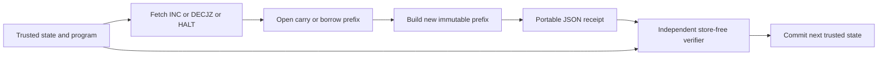

# Authenticated binary-counter virtual hardware

The universal W33 guest now has an executable memory backend: `INC` and
`DECJZ` rewrite persistent binary digits, and a verifier with no memory store
checks those effects from a receipt. The verifier needs the trusted current
state, the program and its placement, plus the opened carry/borrow prefix.
It does not need the counter's untouched tail or the other counter.

This extends `w33_typed_universal_microvm.py`, whose arithmetic uses host
integers; `w33_merkle_capability_memory.py`, which introduced persistent
content identity; and `w33_structured_counter_bytecode_compiler.py`, which
already supplies the labelled universal IR. It does not replace
`w33_wasm_trace_counter_refinement.py`: that file explicitly specializes a
completed Wasm invocation, and a static arbitrary-input Wasm compiler remains
open. No new computability or geometric uniqueness claim is made here.

## The actual execution process

The virtual machine has a program store, a program counter, two counter-root
registers, a current portal, an instruction sequence number, and an immutable
bit-node store. State also binds the program image, instruction placement,
session and construction-time carrier. These descriptors are software state,
not hardware capability tags or signatures.



1. **FETCH:** select the instruction from the trusted image and PC. Its placement
   supplies the target W33 portal; the existing geometry supplies the dispatch route.
2. **SCAN:** follow authenticated low-order bits until a carry or borrow stops.
   Zero is a distinguished digest, so the zero branch reads no nodes.
3. **REBUILD:** share the unopened tail and allocate only the changed prefix.
4. **VERIFY:** independently authenticate each opening and reconstruct the new
   root, branch, sequence, carrier, session and route. Extra, missing or forged
   openings fail. The verifier never calls the prover's arithmetic or store.
5. **COMMIT:** the caller replaces its trusted state with the returned state.
   A duplicate receipt then fails the expected-pre-state check. A distributed
   implementation must serialize that replacement; this reference API does
   not supply consensus, crash-durable atomic storage or capability enforcement.

`Receipt.to_json/from_json` makes the proof portable. A replacement worker can
reproduce a step with just its opened nodes; untouched memory may remain remote.
Missing nodes cause a missing-data exception, not a fabricated zero. The host
harness has finite fuel, and exhausting fuel is distinct from guest HALT. An
opening budget is checked during SCAN, before any new nodes or state are written.
Mid-instruction continuation/resume is not implemented; a budget-limited caller
must retry with adequate resources.

## Refinement for every finite counter value

Let `Z` represent zero. A node `B(b,t)` has value
`V(B(b,t)) = b + 2 V(t)`. A nonempty list's highest digit is one; `B(0,Z)` is
rejected. Genesis imports natural numbers into this canonical representation.

For increment, a prefix of `k` low ones followed by zero has
`n = (2^k - 1) + 2^(k+1)t`. Replacing those ones by zeros and the next zero by
one yields `n+1`. If the list ends after those ones, append a high one instead.
For nonzero decrement, a prefix of `k` low zeros followed by one has
`n = 2^k(1+2t)`. The replacement is `k` ones followed by a zero and tail `t`,
with value `(2^k-1) + 2^(k+1)t = n-1`; omit the high zero when `t=0`.
The zero branch and HALT preserve both roots. These cases preserve canonicality.

Therefore decoding the roots after one successful step gives exactly the
existing guest transition, with the same PC and halt state. Induction extends
this to every finite execution prefix of every admitted finite `Program`.
Abstract universality is inherited from the existing two-counter semantics,
with extensible finite storage for each finite execution; no fixed finite
physical device is asserted to have infinite memory. This is a mathematical
argument with executable checks, not a mechanized proof of the Python code.

The verifier's assurance additionally assumes a trusted canonical genesis and
collision-resistant hashes. It authenticates all opened nodes from the trusted
root and leaves every unvisited subtree unchanged. Arbitrary externally supplied
roots need separate admission. A root proves neither authorization nor availability.

## Measured software costs and checks

Run from the repository root:

```sh
python3 analysis/w33_authenticated_counter_machine.py
python3 tests/test_w33_authenticated_counter_machine.py
```

The frozen output is `w33_authenticated_counter_machine_certificate.json`.
The certificate checks 1,024 small transitions: 256 inputs, two registers, and
both arithmetic instructions. The existing addition program maps `(7,11)` to
`(18,0)` in 24 steps under all 40 cyclic placement shifts. Tests additionally
compare seeded arbitrary programs against the existing VM on both carrier types,
disable integer import/export during long arithmetic, and mutate receipts.

| Operation | Counter bits | Opened nodes | Constructed nodes | JSON receipt bytes |
|---|---:|---:|---:|---:|
| Increment `2^4096` | 4097 | 1 | 1 | 1157 |
| Increment `2^4096-1` | 4096 | 4096 | 4097 | 373804 |
| Decrement `2^4096` | 4097 | 4097 | 4096 | 373895 |

These are descriptor counts and serialized bytes, not cycles, energy or network
benchmarks. Worst-case proof size is linear in counter bit length. Immutable
history accumulates without external GC. The W33 diameter-two bound covers
instruction dispatch only; storage-node access and proof transfer have additional
costs and do not acquire constant latency from that bound. No physical photonic
implementation, quantum advantage or cryptographic succinctness is claimed.

## External checks and scope of originality

Authenticated data structures and outsourced operations with verifiable results
are established prior art: [Miller, Hicks, Katz and Shi, POPL 2014](https://www.cs.umd.edu/~jkatz/papers/ADS.pdf).
The source/target simulation obligation follows standard compiler-correctness
practice; see [CompCert's semantic-preservation construction](https://compcert.org/doc/html/compcert.driver.Compiler.html).
The repository-specific addition is the binary-list realization, portable
transition proof and independent verifier for the existing universal guest.
Counter values and their bit lists are classical information; this construction
does not copy unknown quantum states.

The original requested history/paper intake is **not complete**. Earlier work
captured 183 W33 and 219 Holotrade commits; later census found 12 additional
W33 commits on `origin-https/master` and 15 Holotrade continuation commits.
Capture, programmatic inspection and reading are distinct. Photonic body reading
was completed across sessions, but recursive inserts, the W33 body tail, blueprint
body and full history reading still have outstanding coverage. No full-corpus
novelty or completion claim is made by this engineering increment.
